# Creel

<p align="center">
  
</p>

A secure LLM task runner and personal AI assistant that separates credential-bearing data fetching from LLM processing. Supports both scheduled tasks (morning briefings, weather summaries) and interactive agent mode (chat via CLI or iMessage with tool calling).

A creel is a wicker basket usually used for carrying fish or blocks of peat. It is also the fish trap used to catch lobsters and other crustaceans.

## Why

Agentic LLM systems give the model access to tools, credentials, and untrusted input all at once. This project preserves the core security property — the LLM never sees credentials — whether running scheduled tasks or interactive agent conversations:

| Component | Has access to | Does NOT have |
|-----------|--------------|---------------|
| Executor (gcal) | Google OAuth token (read-only) | LLM, other credentials |
| Executor (gcal_write) | Google OAuth token (calendar.events) | LLM, other credentials |
| Executor (gmail_readonly) | Google OAuth token (read-only) | LLM, other credentials |
| Executor (gmail_send) | Google OAuth token (gmail.send) | LLM, other credentials |
| Executor (gmail_modify) | Google OAuth token (gmail.modify) | LLM, other credentials |
| Executor (drive) | Google OAuth token (read-only) | LLM, other credentials |
| Executor (drive_write) | Google OAuth token (drive.file) | LLM, other credentials |
| Executor (bluebubbles) | BlueBubbles API password | LLM, other credentials |
| Executor (brave_search) | Brave API key | LLM, other credentials |
| Executor (apple_notes) | Bridge HTTP access (scoped token) | LLM, other credentials |
| Executor (apple_reminders) | Bridge HTTP access (scoped token) | LLM, other credentials |
| Executor (things) | Bridge HTTP access (scoped token) | LLM, other credentials |
| Executor (imessage_bridge) | Bridge HTTP access (scoped token) | LLM, other credentials |
| Executor (exec) | Host filesystem (mounted paths only) | LLM, other credentials |
| Executor (fetch_url) | Nothing sensitive | LLM, other credentials |
| Executor (weather) | Nothing sensitive | LLM, other credentials |
| LLM Runner | Anthropic API key | Any other credentials |
| Orchestrator | All secrets, LLM output | Untrusted external input |

Even if prompt injection occurs (e.g., via a calendar event title), the LLM container has nothing to exfiltrate except its own API key.

## Architecture

```mermaid
flowchart TD
    subgraph orch["Orchestrator"]
        direction TB
        schedule["Cron Scheduler"]
        template["Prompt Template"]
        output["Output Router"]
    end

    subgraph container_execs["Containerized Executors"]
        direction TB
        gcal["Executor: gcal\n🔑 Google OAuth token\n(calendar.readonly)"]
        gcal_w["Executor: gcal_write\n🔑 Google OAuth token\n(calendar.events)"]
        gmail["Executor: gmail_readonly\n🔑 Google OAuth token\n(gmail.readonly)"]
        gmail_s["Executor: gmail_send\n🔑 Google OAuth token\n(gmail.send)"]
        gmail_m["Executor: gmail_modify\n🔑 Google OAuth token\n(gmail.modify)"]
        drive["Executor: drive\n🔑 Google OAuth token\n(drive.readonly)"]
        drive_w["Executor: drive_write\n🔑 Google OAuth token\n(drive.file)"]
        bb["Executor: bluebubbles\n🔑 BlueBubbles API password"]
        brave["Executor: brave_search\n🔑 Brave API key"]
        fetch["Executor: fetch_url\n🔑 None"]
        weather["Executor: weather\n🔑 None"]
        exec["Executor: exec\n🔑 None (mounted paths)"]
    end

    subgraph bridge_execs["Bridge-Proxied Executors"]
        direction TB
        notes["Executor: apple_notes\n🔑 Bridge token"]
        reminders["Executor: apple_reminders\n🔑 Bridge token"]
        things["Executor: things\n🔑 Bridge token"]
        imsg_bridge["Executor: imessage_bridge\n🔑 Bridge token"]
    end

    subgraph bridge["Host Bridge Server"]
        direction TB
        bridge_api["FastAPI Server\n(Host Process)"]
        memo_cli["memo CLI"]
        remindctl_cli["remindctl CLI"]
        things_cli["things CLI"]
        imsg_cli["imsg CLI"]
    end

    subgraph llm_container["Isolated LLM Container"]
        llm["LLM Runner\n🔑 Anthropic API key"]
    end

    subgraph outputs["Delivery"]
        imsg["iMessage"]
        stdout["stdout"]
        file["File"]
    end

    schedule -- "triggers" --> gcal
    schedule -- "triggers" --> gcal_w
    schedule -- "triggers" --> gmail
    schedule -- "triggers" --> gmail_s
    schedule -- "triggers" --> gmail_m
    schedule -- "triggers" --> drive
    schedule -- "triggers" --> drive_w
    schedule -- "triggers" --> bb
    schedule -- "triggers" --> brave
    schedule -- "triggers" --> fetch
    schedule -- "triggers" --> weather
    schedule -- "triggers" --> exec
    schedule -- "triggers" --> notes
    schedule -- "triggers" --> reminders
    schedule -- "triggers" --> things
    schedule -- "triggers" --> imsg_bridge

    gcal -- "JSON" --> template
    gcal_w -- "JSON" --> template
    gmail -- "JSON" --> template
    gmail_s -- "JSON" --> template
    gmail_m -- "JSON" --> template
    drive -- "JSON" --> template
    drive_w -- "JSON" --> template
    bb -- "JSON" --> template
    brave -- "JSON" --> template
    fetch -- "JSON" --> template
    weather -- "JSON" --> template
    exec -- "JSON" --> template

    notes -- "HTTP" --> bridge_api
    reminders -- "HTTP" --> bridge_api
    things -- "HTTP" --> bridge_api
    imsg_bridge -- "HTTP" --> bridge_api

    bridge_api --> memo_cli
    bridge_api --> remindctl_cli
    bridge_api --> things_cli
    bridge_api --> imsg_cli

    notes -- "JSON" --> template
    reminders -- "JSON" --> template
    things -- "JSON" --> template
    imsg_bridge -- "JSON" --> template

    template -- "rendered prompt\n(no secrets)" --> llm
    llm -- "text response" --> output
    output --> imsg
    output --> stdout
    output --> file

    style container_execs fill:#2d333b,stroke:#f47067,stroke-width:2px,color:#f0f0f0
    style bridge_execs fill:#2d333b,stroke:#f47067,stroke-width:2px,color:#f0f0f0
    style bridge fill:#2d333b,stroke:#fd7e14,stroke-width:2px,color:#f0f0f0
    style llm_container fill:#2d333b,stroke:#f47067,stroke-width:2px,color:#f0f0f0
    style orch fill:#2d333b,stroke:#58a6ff,stroke-width:2px,color:#f0f0f0
    style outputs fill:#2d333b,stroke:#3fb950,stroke-width:2px,color:#f0f0f0
```



> **Key insight:** Even if prompt injection occurs (e.g., via a calendar event title), the LLM container has no access to Google credentials, user contacts, or anything beyond its own API key. Each red box is a separate security boundary.

### Agent Mode

In agent mode, the same security boundary applies — the LLM requests tool calls, but the orchestrator handles secrets injection and executor execution:

```
                    ┌──────────────────┐
                    │     Channels     │
                    │stdin | iMsg | BB │
                    └────────┬─────────┘
                           │ incoming message
                           ▼
                    ┌──────────────┐
                    │   Session    │
                    │   Manager   │
                    │ (JSON files) │
                    └──────┬──────┘
                           │ message + history
                           ▼
              ┌────────────────────────┐
              │      Agent Loop        │
              │                        │
              │  messages ──→ LLM call │
              │               ↓        │
              │          tool_use? ─no─→ response
              │               ↓ yes    │
              │     execute via executor │
              │     (secrets injected)  │
              │               ↓        │
              │     tool_result → loop  │
              └────────────────────────┘
```

Scheduled tasks can also use agent mode by setting `mode: agent` in the task YAML.

### Guardian

The guardian layer screens inputs and validates tool calls before they execute. All stages are optional and independently configurable in `agent.yaml`:

```
Incoming message
    │
    ▼
screen_input(text)                     ← before session history
    ├── FastClassifier  (DeBERTa/ONNX, ~10ms)
    └── LLMJudge        (Haiku, ~300ms, off by default)
    │
    │  blocked → return rejection, skip agent loop
    │
    ▼
Agent loop → LLM returns tool_use
    │
    ▼
validate_action(tool, args)            ← before execute_tool_call
    ├── PolicyEngine    (YAML rules, <1ms)
    │      allow  → execute
    │      review → human approval or auto_approve
    │      deny   → return error to LLM
    │
    └── CoherenceCheck  (Haiku, ~300ms)
           coherent   → execute
           incoherent → return error to LLM
```

**Stages:**

| Stage | Component | What it does |
|-------|-----------|--------------|
| 1 | Fast classifier | Local DeBERTa model scores prompt-injection likelihood against a confidence threshold |
| 2 | LLM judge | Secondary Haiku-based check (disabled by default) |
| 3 | Policy engine | `fnmatch` rules in `policies/default.yaml` map tool names to allow/review/deny |
| 4 | Coherence check | LLM-based check that tool calls match the user's original intent (catches prompt injection causing unrelated actions) |

**Policy rules** (`policies/default.yaml`):

```yaml
allow:  [check_weather, check_calendar, check_email, read_email, check_drive, check_messages, get_chats, react_imessage]
review: [send_*, upload_*, create_*, mark_*, trash_*]
deny:   [delete_*]

# Tools that match 'review' rules but can skip human approval
auto_approve:
  - mark_read
  - react_imessage
```

Deny wins over review, review wins over allow. Unknown tools default to review. Tools listed in `auto_approve` skip the human confirmation prompt even when matched by a review rule.

**Human-in-the-loop review:** Tools matching `review` rules prompt the user for approval before executing. In the TUI, this appears as an inline confirmation dialog. A configurable timeout (default 60s) denies the action if no response is received.

**Audit logging** writes to `guardian_audit.jsonl` with hashed inputs (never raw text), tool names, arg keys (not values), verdicts, and confidence scores.

**Configuration** in `agent.yaml`:

```yaml
guardian:
  enabled: true
  review:
    timeout_seconds: 60
    default_on_timeout: deny
  fast_classifier:
    enabled: true
    threshold: 0.95
    model_name: protectai/deberta-v3-base-prompt-injection-v2
  llm_judge:
    enabled: false
  coherence:
    enabled: true
    model: claude-haiku-4-5-20251001
    max_tokens: 256
  policy:
    enabled: true
    policy_file: policies/default.yaml
  audit:
    enabled: true
    log_file: guardian_audit.jsonl
```

## Host Bridge

For macOS-specific tools (Apple Notes, Apple Reminders, Things 3, iMessage), Docker containers can't directly execute AppleScript or access macOS applications. The host bridge solves this by running a FastAPI server on the host system that provides authenticated HTTP endpoints for containerized executors.

**Why**: Docker containers are sandboxed and can't access the macOS scripting bridge or application APIs that tools like Notes, Reminders, and Things 3 require.

**How**: A FastAPI server (`python -m bridge.server`) runs as a host process and exposes REST endpoints at `/notes/*`, `/reminders/*`, `/things/*`, and `/imessage/*`. Containerized executors make HTTP requests to these endpoints with scoped authentication tokens.

**Security**: Each executor receives a scoped token that only grants access to its specific tool endpoints. For example, the `apple_notes` executor can only call `/notes/*` endpoints, not `/reminders/*` or `/things/*`.

**CLI Integration**: The bridge server delegates to command-line tools:
- **Apple Notes**: `memo` CLI for reading/writing notes
- **Apple Reminders**: `remindctl` CLI for managing reminders  
- **Things 3**: `things` CLI for task management
- **iMessage**: `imsg` CLI for sending/receiving messages

**Starting the bridge**: `python -m bridge.server --host 127.0.0.1 --port 8099` starts the FastAPI server with authentication middleware and scoped endpoint routing.

## Exec Tool

The exec executor provides sandboxed shell command execution within isolated Docker containers. It's designed for running system commands, scripts, and CLI tools while maintaining security through filesystem isolation and network restrictions.

**Sandboxing**: Commands execute in a minimal Alpine Linux container (`alpine:latest`) with:
- **Network isolation**: `--network=none` by default (no internet access)
- **Filesystem isolation**: Only configured mount points are accessible
- **Minimal base**: Just `bash`, `grep`, `sed`, `awk`, `curl`, `jq` installed
- **Read-only root**: Container filesystem is read-only except for mounted paths

**Mount Configuration**: Mount points specify host paths and access modes:
- **Path mapping**: Host directory → container directory  
- **Access modes**: `ro` (read-only) or `rw` (read-write)
- **Scope limitation**: Only explicitly mounted paths are accessible

**Future Enhancement**: Specialized container images for different use cases:
- `exec-dev`: Development tools (git, make, compilers)
- `exec-python`: Python runtime and common packages
- `exec-node`: Node.js runtime and npm

## Quick Start

```bash
# Set up Python and virtualenv (requires pyenv and uv)
pyenv install 3.12.12   # if not already installed
uv venv
source .venv/bin/activate
uv pip install -e ".[dev]"

# Optional: required for live ONNX export + classifier smoke tests
uv pip install -e ".[guardian]"

# Install age for secrets encryption (one-time)
brew install age
mkdir -p ~/.age
age-keygen -o ~/.age/key.txt 2> ~/.age/key.pub

# List available tasks
creel list

# Validate a task definition
creel validate weather_check

# Dry run (renders prompt, skips LLM and output)
creel run weather_check --dry

# Full run (requires Anthropic credentials — see Authentication below)
creel run weather_check

# Start the cron scheduler
creel schedule

# Start background daemon (agent loop + scheduler + channel plugins)
creel daemon start

# Attach rich TUI to running daemon
creel attach

# Send one message without opening TUI
creel send "What's on my calendar today?"

# Query daemon status
creel daemon status

# Stop daemon
creel daemon stop

# Query the guardian audit log
creel audit
creel audit --blocked --tail 50
```

## Authentication

The runner supports two ways to authenticate with the Anthropic API:

| Method | Env var | How to get it |
|--------|---------|---------------|
| API key | `ANTHROPIC_API_KEY` | [console.anthropic.com](https://console.anthropic.com/) |
| Claude Code setup token | `ANTHROPIC_AUTH_TOKEN` | `claude setup-token` |

If both are set, `ANTHROPIC_AUTH_TOKEN` takes precedence.

### Using an API key

```bash
export ANTHROPIC_API_KEY=sk-ant-...
creel run weather_check
```

### Using a Claude Code setup token

Claude Code can generate OAuth tokens that work with the Anthropic API:

```bash
# Generate a setup token (requires Claude Code CLI)
claude setup-token
# Copy the sk-ant-oat01-... value

export ANTHROPIC_AUTH_TOKEN=sk-ant-oat01-...
creel run weather_check
```

### Storing credentials in a secrets file

Either variable can go in an age-encrypted secrets file:

```bash
# Create the plaintext .env
echo 'ANTHROPIC_AUTH_TOKEN=sk-ant-oat01-...' > secrets/anthropic.env

# Encrypt and delete plaintext
./scripts/encrypt-secret.sh secrets/anthropic.env
rm secrets/anthropic.env
```

Then reference it in your task YAML under `llm.secrets`.

### Root `.env` file

The runner loads a root `.env` file (gitignored) at startup for non-secret configuration like phone numbers:

```bash
# .env (project root — gitignored, never committed)
PHONE=+1234567890
```

Values are available as environment variables and can be referenced in task YAMLs with `$VAR` syntax:

```yaml
output:
  type: imessage
  to: "$PHONE"
```

Real environment variables take precedence over `.env` values.

## Task Definitions

Tasks are YAML files in `tasks/`. Each defines what data to fetch, how to prompt the LLM, and where to send the result.

```yaml
# tasks/morning_briefing.yaml
name: morning_briefing
schedule: "0 7 * * *"  # 7am daily

fetch:
  calendar:
    image: executor-gcal:latest
    secrets: secrets/gcal.env.enc
    args:
      range: today

  weather:
    image: executor-weather:latest
    args:
      location: denver

prompt: |
  You're my personal assistant. Give me a quick rundown of my day.

  Today: {date}
  Weather: {weather}
  Calendar: {calendar}

  Keep it under 150 words. Flag any early meetings or conflicts.

output:
  type: imessage
  to: "$PHONE"

llm:
  model: claude-sonnet-4-20250514
  max_tokens: 300
  secrets: secrets/anthropic.env.enc
```

### Task fields

| Field | Required | Description |
|-------|----------|-------------|
| `name` | yes | Unique task identifier |
| `schedule` | yes | 5-part cron expression |
| `fetch` | yes | Map of executor name to config |
| `fetch.<name>.image` | yes | Docker image for containerized mode |
| `fetch.<name>.secrets` | no | Path to age-encrypted .env file |
| `fetch.<name>.args` | no | Key-value args passed to the executor |
| `prompt` | yes | Prompt template with `{name}` placeholders |
| `output.type` | yes | `imessage`, `stdout`, or `file` |
| `output.to` | yes | Phone number, empty string, or file path |
| `llm.model` | no | Anthropic model ID (default: `claude-sonnet-4-20250514`) |
| `llm.max_tokens` | no | Max response tokens (default: 300) |
| `llm.secrets` | no | Path to age-encrypted .env with `ANTHROPIC_AUTH_TOKEN` or `ANTHROPIC_API_KEY` |

The `{date}` placeholder is always available and resolves to the current date.

### Agent mode tasks

Tasks can use the agent loop for multi-step tool calling by setting `mode: agent`:

```yaml
# tasks/email_triage.yaml
name: email_triage
schedule: "0 8 * * *"
mode: agent

fetch:
  gmail:
    image: executor-gmail:latest
    secrets: secrets/gmail.env.enc
    args:
      query: "is:unread newer_than:1d"

tools:
  trash_email:
    executor: gmail_modify
    secrets: secrets/gmail_modify.env.enc
    description: "Move an email to trash"
    parameters:
      message_id:
        type: string
        description: "Gmail message ID"
        required: true
    fixed_args:
      action: "trash"

agent:
  max_turns: 10

prompt: |
  Triage my unread emails. Trash spam. Summarize what you did.
  {gmail}

output:
  type: imessage
  to: "$PHONE"

llm:
  model: claude-sonnet-4-20250514
  max_tokens: 1024
  secrets: secrets/anthropic.env.enc
```

Agent mode task fields (in addition to standard fields):

| Field | Required | Description |
|-------|----------|-------------|
| `mode` | no | `simple` (default) or `agent` |
| `tools` | no | Map of tool name to tool config |
| `tools.<name>.executor` | yes | Executor to execute (e.g., `gmail_modify`) |
| `tools.<name>.secrets` | no | Path to age-encrypted .env file |
| `tools.<name>.description` | yes | Description shown to the LLM |
| `tools.<name>.parameters` | no | Parameters the LLM can provide |
| `tools.<name>.fixed_args` | no | Args always passed to executor (override LLM input) |
| `agent.max_turns` | no | Max agent loop iterations (default: 10) |

## Agent Configuration

The global agent config (`agent.yaml`) defines tools, LLM settings, session behavior, channels, workspace memory, and guardian settings for interactive chat mode:

```yaml
system_prompt: |
  You are a personal assistant. Be concise and helpful.
  Today is {date}.

tools:
  check_weather:
    executor: weather
    description: "Get current weather and forecast"
    parameters:
      location:
        type: string
        description: "City name or coordinates"
        required: true

  check_email:
    executor: gmail_readonly
    secrets: secrets/gmail.env.enc
    description: "Search Gmail for emails"
    parameters:
      query:
        type: string
        description: "Gmail search query"
        required: true

  # ... see agent.yaml for all tools (calendar, drive, iMessage, etc.)

llm:
  model: claude-sonnet-4-20250514
  max_tokens: 1024
  secrets: secrets/anthropic.env.enc

agent:
  max_turns: 15

session:
  sessions_dir: sessions
  max_history: 50
  summarize_on_trim: true

workspace:
  path: workspace
  timezone: "America/Denver"
  memory_days: 2
  memory_max_chars: 5000
  max_chars_per_file: 20000

channels:
  imessage:
    listen_to: "$PHONE"
    poll_interval: 3
  bluebubbles:
    server_url: "$BLUEBUBBLES_URL"
    password: "$BLUEBUBBLES_PASSWORD"
    listen_to:
      - "$PHONE"
    poll_interval: 3
```

Sessions are stored as JSON files in `sessions/` (gitignored) and persist conversation history across interactions. When `summarize_on_trim` is enabled, old messages are summarized before being trimmed.

**Workspace memory** provides file-based memory across sessions:
- `workspace/memory/YYYY-MM-DD.md` — daily append-only logs written by the agent's `remember` tool
- `workspace/MEMORY.md` — curated long-term memory

Recent daily logs and long-term memory are injected into the system prompt automatically.

### Quiet Hours

Creel supports quiet hours to suppress proactive notifications during configured time periods (e.g., nighttime, work hours). Quiet hours are configured in `agent.yaml` and only suppress outbound notifications — direct replies to user messages are never suppressed.

```yaml
quiet_hours:
  enabled: true
  start: "22:00"  # 10 PM
  end: "08:00"    # 8 AM
  timezone: "America/Denver"
```

## Executors

### Weather

Uses [wttr.in](https://wttr.in) - no API key required.

```yaml
weather:
  image: executor-weather:latest
  args:
    location: denver   # city name or coordinates
```

### Google Calendar

Requires a one-time OAuth setup:

```bash
# 1. Create GCP project, enable Calendar API, download OAuth credentials
# 2. Run the setup script (--encrypt auto-encrypts and deletes plaintext)
python scripts/setup-google-oauth.py gcal --encrypt
```

The executor uses a read-only scope (`calendar.readonly`) and authenticates with a refresh token.

### Gmail (Read)

Reads emails matching a Gmail search query. Supports both listing emails and reading individual messages by ID. Requires a one-time OAuth setup:

```bash
# Same GCP project — enable the Gmail API
python scripts/setup-google-oauth.py gmail --encrypt
```

The executor uses a read-only scope (`gmail.readonly`). Configuration:

```yaml
gmail_readonly:
  image: executor-gmail-readonly:latest
  secrets: secrets/gmail.env.enc
  args:
    query: "is:unread newer_than:1d"   # Gmail search syntax
    max_results: "20"                   # max messages to fetch
    message_id: ""                      # set to read a specific email by ID
```

When reading a single message by ID, the full decoded body is returned (prefers `text/plain`, falls back to HTML stripping via BeautifulSoup).

### Google Calendar (Write)

Creates calendar events. Requires a one-time OAuth setup with the `calendar.events` scope:

```bash
python scripts/setup-google-oauth.py gcal_write --encrypt
```

Configuration:

```yaml
gcal_write:
  image: executor-gcal-write:latest
  secrets: secrets/gcal_write.env.enc
  args:
    summary: "Team standup"
    start: "2025-01-15T09:00:00-07:00"   # ISO 8601
    end: "2025-01-15T09:30:00-07:00"
    description: "Daily sync"              # optional
    location: "Room 42"                    # optional
```

### Gmail (Send)

Sends an email. Requires a one-time OAuth setup with the `gmail.send` scope:

```bash
python scripts/setup-google-oauth.py gmail_send --encrypt
```

Configuration:

```yaml
gmail_send:
  image: executor-gmail-send:latest
  secrets: secrets/gmail_send.env.enc
  args:
    to: "recipient@example.com"
    subject: "Daily report"
    body: "Here is today's summary..."
```

### Gmail (Modify)

Modifies, trashes, or permanently deletes Gmail messages. Requires a one-time OAuth setup with the `gmail.modify` scope:

```bash
python scripts/setup-google-oauth.py gmail_modify --encrypt
```

Configuration:

```yaml
gmail_modify:
  image: executor-gmail-modify:latest
  secrets: secrets/gmail_modify.env.enc
  args:
    action: "modify"              # modify, trash, or delete
    message_id: "18f1a2b3c4d5e6f" # Gmail message ID
    add_labels: "STARRED"         # comma-separated label IDs (modify only)
    remove_labels: "UNREAD,INBOX" # comma-separated label IDs (modify only)
```

### Google Drive (Read)

Lists and reads files from Google Drive. Requires a one-time OAuth setup with the `drive.readonly` scope:

```bash
python scripts/setup-google-oauth.py drive --encrypt
```

Configuration:

```yaml
drive:
  image: executor-drive:latest
  secrets: secrets/drive.env.enc
  args:
    query: "mimeType='application/pdf'"   # Drive search query (optional)
    max_results: "20"
```

### Google Drive (Write)

Uploads a file to Google Drive. Requires a one-time OAuth setup with the `drive.file` scope:

```bash
python scripts/setup-google-oauth.py drive_write --encrypt
```

Configuration:

```yaml
drive_write:
  image: executor-drive-write:latest
  secrets: secrets/drive_write.env.enc
  args:
    name: "report.txt"
    content: "File contents here..."
    mime_type: "text/plain"      # optional, defaults to text/plain
    folder_id: ""                # optional Drive folder ID
```

### BlueBubbles (iMessage)

Sends and reads iMessages via a [BlueBubbles](https://bluebubbles.app/) server. Requires a running BlueBubbles instance.

```yaml
bluebubbles:
  image: executor-bluebubbles:latest
  secrets: secrets/bluebubbles.env.enc
  args:
    action: "get_recent_messages"  # get_recent_messages, send_message, send_reaction, get_chats
    chat_id: "chat123"
    limit: "25"
```

Built-in safety: hard caps on message count (50), message length (2000 chars), send rate limiting (10/min), and allowlist enforcement for recipients.

### Brave Search

Web search via the [Brave Search API](https://brave.com/search/api/).

```yaml
brave_search:
  image: executor-brave-search:latest
  secrets: secrets/brave_search.env.enc
  args:
    query: "latest news on AI safety"
    count: "5"   # max 20
```

### Fetch URL

Extracts text content from web pages using BeautifulSoup. Strips scripts, nav, and boilerplate.

```yaml
fetch_url:
  image: executor-fetch-url:latest
  args:
    url: "https://example.com/article"
    max_chars: "10000"
```

No API key required.

### Apple Notes

Reads and creates notes in Notes.app via the host bridge. Uses the `memo` CLI tool for macOS integration.

```yaml
apple_notes:
  args:
    action: "list_notes"   # list_notes, search_notes, read_note, create_note
    folder: "Notes"
    limit: "25"
```

### Apple Reminders

Reads and creates reminders in Reminders.app via the host bridge. Uses the `remindctl` CLI tool for macOS integration.

```yaml
apple_reminders:
  args:
    action: "list_reminders"  # list_reminders, create_reminder, complete_reminder, get_lists
    list_name: "Reminders"
```

### Things 3

Manages tasks in Things 3 via the host bridge. Uses the `things` CLI tool for macOS integration.

```yaml
things:
  args:
    action: "list_tasks"     # list_tasks, create_task, complete_task, search_tasks
    area: "Personal"
    limit: "25"
```

### iMessage Bridge

Sends and reads iMessages via the host bridge. Uses the `imsg` CLI tool for macOS integration, providing an alternative to the BlueBubbles executor.

```yaml
imessage_bridge:
  args:
    action: "get_recent"     # get_recent, send_message, get_chats
    limit: "25"
    chat_id: "chat123"
```

### Exec

Executes shell commands in sandboxed Docker containers with configurable mount points and network isolation.

```yaml
exec:
  args:
    command: "ls -la /workspace"
    workdir: "/workspace"
    mounts:
      - path: "/Users/user/docs"
        target: "/workspace"
        mode: "ro"
```

## Google Services Setup

All Google services use the same OAuth2 client credentials (client ID + client secret from a single GCP project) but obtain **separate refresh tokens** with different scopes. This means:

- One `client_secret.json` file works for all services
- Each service gets its own `.env` file (e.g. `secrets/gcal.env`, `secrets/gmail_send.env`)
- Each refresh token is scoped to a single API permission
- Revoking one token doesn't affect the others

```bash
# Set up all services at once (encrypts automatically)
python scripts/setup-google-oauth.py --all

# Or set up specific services
python scripts/setup-google-oauth.py gmail gcal

# Encrypt with age after each OAuth flow
python scripts/setup-google-oauth.py gmail --encrypt

# Encrypt all existing .env files in secrets/ (no OAuth flow)
python scripts/setup-google-oauth.py --encrypt-all
```

Available services: `gcal`, `gcal_write`, `gmail`, `gmail_send`, `gmail_modify`, `drive`, `drive_write`.

## Secrets Management

Secrets are encrypted at rest using [age](https://github.com/FiloSottile/age). The Python side uses [pyrage](https://pypi.org/project/pyrage/) for decryption.

```bash
# Generate an age key pair (one-time)
mkdir -p ~/.age
age-keygen -o ~/.age/key.txt 2> ~/.age/key.pub

# Encrypt a .env file
./scripts/encrypt-secret.sh secrets/anthropic.env

# The decryption key path defaults to ~/.age/key.txt
# Override with AGE_IDENTITY environment variable
export AGE_IDENTITY=/path/to/key.txt
```

The `.env` format supports `KEY=value`, quoted values, and comments:

```
ANTHROPIC_API_KEY=sk-ant-...
GOOGLE_CREDENTIALS_JSON='{"refresh_token": "...", "client_id": "...", "client_secret": "..."}'
```

## Container Mode

For production use, executors and the LLM runner execute in isolated Docker containers with restricted capabilities. The `--containers` flag works with task runs, scheduler jobs, and daemon runtime:

```bash
# Build container images
docker build -t executor-weather:latest executors/weather/
docker build -t executor-gcal:latest executors/gcal/
docker build -t executor-gcal-write:latest executors/gcal_write/
docker build -t executor-gmail-readonly:latest executors/gmail_readonly/
docker build -t executor-gmail-send:latest executors/gmail_send/
docker build -t executor-gmail-modify:latest executors/gmail_modify/
docker build -t executor-drive:latest executors/drive/
docker build -t executor-drive-write:latest executors/drive_write/
docker build -t executor-bluebubbles:latest executors/bluebubbles/
docker build -t executor-brave-search:latest executors/brave_search/
docker build -t executor-fetch-url:latest executors/fetch_url/
docker build -t llm-runner:latest llm/

# Run a task with containers
creel --containers run morning_briefing

# Scheduler with containers
creel --containers schedule

# Daemon runtime with containerized executors
creel --containers daemon start
```

Containers run with:
- `--read-only` filesystem
- `--cap-drop=ALL`
- `--security-opt=no-new-privileges`
- Memory and CPU limits (`256m`, `0.5` CPU)
- 60-second timeout
- Only the secrets each container needs

In daemon mode, the agent loop runs on the host while each tool call (executor) executes in its own isolated container. This preserves the trust boundary: the LLM never sees credentials, and executor code runs sandboxed.

## CLI Reference

```
creel <command> [options]

Commands:
  run <task>        Run a task immediately
  schedule          Start cron scheduler for all tasks
  list              List available tasks
  validate <task>   Validate a task YAML file
  daemon ...        Manage daemon lifecycle (start|stop|status)
  attach            Attach TUI client to running daemon
  send <message>    Send one message via daemon API
  audit             Query the guardian audit log

Global options:
  -v, --verbose       Enable verbose/debug output
  --containers        Run executors/LLM in Docker containers (all commands)
  --tasks-dir PATH    Tasks directory (default: tasks/)
  --agent-config PATH Path to agent.yaml (default: agent.yaml)
  --json-logs         Output structured JSON log lines (for production)
  --no-judge          Disable the LLM judge to save API calls during development

Run options:
  --dry             Render prompt only, skip LLM and output

Daemon start options:
  --socket-path PATH   Unix socket path (default: /tmp/creel-daemon.sock)
  --pid-file PATH      PID file path (default: /tmp/creel-daemon.pid)
  --log-file PATH      Daemon log file (default: /tmp/creel-daemon.log)
  --channel TYPE       Channel plugin: none, imessage, bluebubbles
  --no-scheduler       Disable scheduler in daemon runtime

Attach options:
  --sender-id ID       Sender ID/session namespace (default: cli)
  --new                Start and attach to a new session
  --resume ID          Attach and resume a specific session
  --socket-path PATH   Unix socket path (default: /tmp/creel-daemon.sock)

Audit options:
  --tail N          Show last N entries (default: 20)
  --all             Show all entries
  --blocked         Show only blocked input events
  --denied          Show only denied action events
  --event TYPE      Filter by event type (screen_input, validate_action, tool_result)
  --tool NAME       Filter by tool name
  --since DATE      Show entries since date (YYYY-MM-DD or YYYY-MM-DDTHH:MM:SS)
```

## Project Structure

``` 
creel/
├── agent.yaml             # Global agent config (tools, channels, sessions, guardian)
├── pyproject.toml
├── tasks/                 # Task definitions (YAML)
├── policies/              # Guardian policy rules
├── secrets/               # Encrypted .env files (gitignored)
├── scripts/               # Utility scripts (encryption, OAuth setup)
├── src/
│   ├── taskrunner/
│   │   ├── cli.py         # creel CLI entrypoint
│   │   ├── daemon/        # Daemon service, API, client contracts
│   │   ├── chat.py        # Agent/session router
│   │   ├── tui.py         # Textual TUI client
│   │   ├── scheduler.py   # APScheduler integration
│   │   ├── session.py     # JSON file-backed conversation sessions
│   │   └── channels/      # iMessage + BlueBubbles channel plugins
│   ├── bridge/
│   │   └── server.py      # Host bridge HTTP API for macOS-native tools
│   ├── executors/         # Tool executors (weather, Google, Notes, etc.)
│   ├── guardian/          # Prompt-injection + policy protection pipeline
│   └── llm/               # Containerized LLM runner
├── tests/
├── approvals/             # Pending approval queue (gitignored)
└── workspace/             # Agent workspace memory (gitignored)
```

## Development

Requires [pyenv](https://github.com/pyenv/pyenv) and [uv](https://github.com/astral-sh/uv).

```bash
# First-time setup
pyenv install 3.12.12   # .python-version pins this
uv venv                 # creates .venv using pyenv's Python
source .venv/bin/activate
uv pip install -e ".[dev]"

# Optional: required for live ONNX export + classifier smoke tests
uv pip install -e ".[guardian]"

# Run tests
pytest
```
