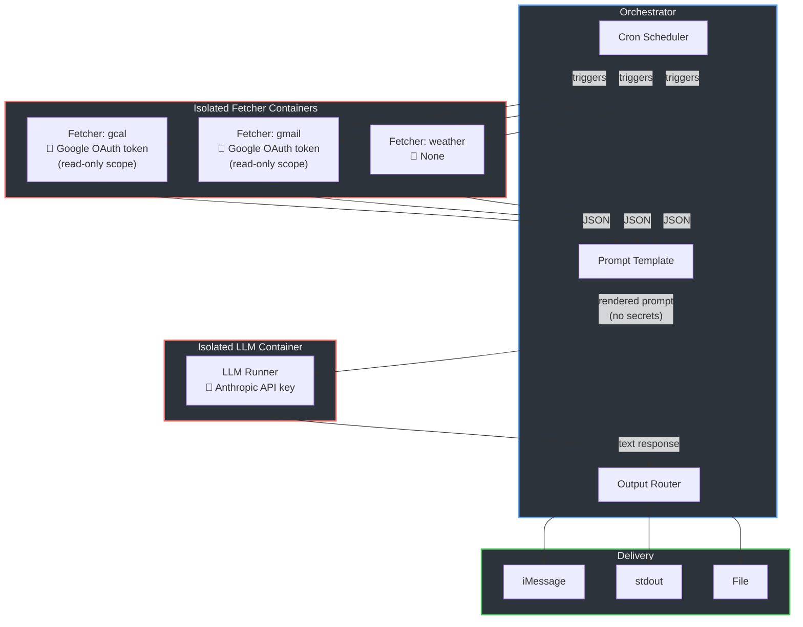

# LLM Task Runner

A secure, scheduled task runner that separates credential-bearing data fetching from LLM processing. Designed for predictable, recurring tasks (morning briefings, weather summaries) where full agentic autonomy is unnecessary and the security risk isn't worth it.

## Why

Agentic LLM systems give the model access to tools, credentials, and untrusted input all at once. For scheduled tasks with known data sources and fixed output destinations, that's a bad trade-off. This project splits the problem:

| Component | Has access to | Does NOT have |
|-----------|--------------|---------------|
| Fetcher (gcal) | Google OAuth token (read-only) | LLM, other credentials |
| Fetcher (gmail) | Google OAuth token (read-only) | LLM, other credentials |
| Fetcher (weather) | Nothing sensitive | LLM, other credentials |
| LLM Runner | Anthropic API key | Any other credentials |
| Orchestrator | All secrets, LLM output | Untrusted external input |

Even if prompt injection occurs (e.g., via a calendar event title), the LLM container has nothing to exfiltrate except its own API key.

## Architecture



> **Key insight:** Even if prompt injection occurs (e.g., via a calendar event title), the LLM container has no access to Google credentials, user contacts, or anything beyond its own API key. Each red box is a separate security boundary.

## Quick Start

```bash
# Set up Python and virtualenv (requires pyenv and uv)
pyenv install 3.12.12   # if not already installed
uv venv
source .venv/bin/activate
uv pip install -e ".[dev]"

# List available tasks
./runner.py list

# Validate a task definition
./runner.py validate weather_check

# Dry run (renders prompt, skips LLM and output)
./runner.py run weather_check --dry

# Full run (requires ANTHROPIC_API_KEY)
export ANTHROPIC_API_KEY=sk-...
./runner.py run weather_check

# Start the cron scheduler
./runner.py schedule
```

## Task Definitions

Tasks are YAML files in `tasks/`. Each defines what data to fetch, how to prompt the LLM, and where to send the result.

```yaml
# tasks/morning_briefing.yaml
name: morning_briefing
schedule: "0 7 * * *"  # 7am daily

fetch:
  calendar:
    image: fetcher-gcal:latest
    secrets: secrets/gcal.env.enc
    args:
      range: today

  weather:
    image: fetcher-weather:latest
    args:
      location: denver

prompt: |
  You're my personal assistant. Give me a quick rundown of my day.

  Today: {date}
  Weather: {weather}
  Calendar: {calendar}

  Keep it under 150 words. Flag any early meetings or conflicts.

output:
  type: imessage
  to: "+1XXXXXXXXXX"

llm:
  model: claude-sonnet-4-20250514
  max_tokens: 300
  secrets: secrets/anthropic.env.enc
```

### Task fields

| Field | Required | Description |
|-------|----------|-------------|
| `name` | yes | Unique task identifier |
| `schedule` | yes | 5-part cron expression |
| `fetch` | yes | Map of fetcher name to config |
| `fetch.<name>.image` | yes | Docker image for containerized mode |
| `fetch.<name>.secrets` | no | Path to age-encrypted .env file |
| `fetch.<name>.args` | no | Key-value args passed to the fetcher |
| `prompt` | yes | Prompt template with `{name}` placeholders |
| `output.type` | yes | `imessage`, `stdout`, or `file` |
| `output.to` | yes | Phone number, empty string, or file path |
| `llm.model` | no | Anthropic model ID (default: `claude-sonnet-4-20250514`) |
| `llm.max_tokens` | no | Max response tokens (default: 300) |
| `llm.secrets` | no | Path to age-encrypted .env with `ANTHROPIC_API_KEY` |

The `{date}` placeholder is always available and resolves to the current date.

## Fetchers

### Weather

Uses [wttr.in](https://wttr.in) - no API key required.

```yaml
weather:
  image: fetcher-weather:latest
  args:
    location: denver   # city name or coordinates
```

### Google Calendar

Requires a one-time OAuth setup:

```bash
# 1. Create GCP project, enable Calendar API, download OAuth credentials
# 2. Run the setup script
python scripts/setup-google-oauth.py gcal

# 3. Encrypt the credentials
./scripts/encrypt-secret.sh secrets/gcal.env

# 4. Delete plaintext
rm secrets/gcal.env
```

The fetcher uses a read-only scope (`calendar.readonly`) and authenticates with a refresh token.

### Gmail

Reads emails matching a Gmail search query. Requires a one-time OAuth setup:

```bash
# 1. Same GCP project — enable the Gmail API
# 2. Run the setup script (uses the same client_secret.json)
python scripts/setup-google-oauth.py gmail

# 3. Encrypt the credentials
./scripts/encrypt-secret.sh secrets/gmail.env

# 4. Delete plaintext
rm secrets/gmail.env
```

The fetcher uses a read-only scope (`gmail.readonly`). Configuration:

```yaml
gmail:
  image: fetcher-gmail:latest
  secrets: secrets/gmail.env.enc
  args:
    query: "is:unread newer_than:1d"   # Gmail search syntax
    max_results: "25"                   # max messages to fetch
    full_body: "false"                  # set "true" to include decoded body text
```

When `full_body` is enabled, the fetcher decodes MIME parts (prefers `text/plain`, falls back to HTML stripping via BeautifulSoup).

## Google Services Setup

Google Calendar and Gmail use the same OAuth2 client credentials (client ID + client secret from a single GCP project) but obtain **separate refresh tokens** with different scopes. This means:

- One `client_secret.json` file works for both services
- Each service gets its own `.env` file (`secrets/gcal.env`, `secrets/gmail.env`)
- Each refresh token is scoped to a single API (read-only)
- Revoking one token doesn't affect the other

Use `scripts/setup-google-oauth.py <service>` to run the OAuth flow for each service.

## Secrets Management

Secrets are encrypted at rest using [age](https://github.com/FiloSottile/age). The Python side uses [pyrage](https://pypi.org/project/pyrage/) for decryption.

```bash
# Generate an age key pair (one-time)
mkdir -p ~/.age
age-keygen -o ~/.age/key.txt 2> ~/.age/key.pub

# Encrypt a .env file
./scripts/encrypt-secret.sh secrets/anthropic.env

# The decryption key path defaults to ~/.age/key.txt
# Override with AGE_IDENTITY environment variable
export AGE_IDENTITY=/path/to/key.txt
```

The `.env` format supports `KEY=value`, quoted values, and comments:

```
ANTHROPIC_API_KEY=sk-ant-...
GOOGLE_CREDENTIALS_JSON='{"refresh_token": "...", "client_id": "...", "client_secret": "..."}'
```

## Container Mode

For production use, fetchers and the LLM runner execute in isolated Docker containers with restricted capabilities:

```bash
# Build container images
docker build -t fetcher-weather:latest fetchers/weather/
docker build -t fetcher-gcal:latest fetchers/gcal/
docker build -t fetcher-gmail:latest fetchers/gmail/
docker build -t llm-runner:latest llm/

# Run with containers
./runner.py --containers run morning_briefing
```

Containers run with:
- `--read-only` filesystem
- `--cap-drop=ALL`
- `--security-opt=no-new-privileges`
- Memory and CPU limits
- Only the secrets each container needs

## CLI Reference

```
./runner.py <command> [options]

Commands:
  run <task>        Run a task immediately
  schedule          Start cron scheduler for all tasks
  list              List available tasks
  validate <task>   Validate a task YAML file

Options:
  -v, --verbose     Enable verbose/debug output
  --containers      Run fetchers and LLM in Docker containers
  --tasks-dir PATH  Tasks directory (default: tasks/)

Run options:
  --dry             Render prompt only, skip LLM and output
```

## Project Structure

```
llm-taskrunner/
├── runner.py              # CLI entry point
├── pyproject.toml
├── .python-version        # pyenv Python version pin (3.12)
├── taskrunner/
│   ├── models.py          # Task YAML parsing + Pydantic validation
│   ├── orchestrator.py    # Core loop: fetch -> LLM -> output
│   ├── scheduler.py       # APScheduler cron integration
│   ├── llm.py             # Anthropic API calls (direct + container)
│   ├── outputs.py         # Output routing (iMessage, stdout, file)
│   └── secrets.py         # age encryption/decryption
├── fetchers/
│   ├── weather/           # wttr.in fetcher + Dockerfile
│   ├── gcal/              # Google Calendar fetcher + Dockerfile
│   └── gmail/             # Gmail fetcher + Dockerfile
├── llm/                   # Containerized LLM runner + Dockerfile
├── tasks/                 # Task definitions (YAML)
├── secrets/               # Encrypted .env files (gitignored)
├── scripts/
│   ├── encrypt-secret.sh    # age encryption helper
│   └── setup-google-oauth.py# Google OAuth setup (gcal, gmail)
└── tests/
```

## Development

Requires [pyenv](https://github.com/pyenv/pyenv) and [uv](https://github.com/astral-sh/uv).

```bash
# First-time setup
pyenv install 3.12.12   # .python-version pins this
uv venv                 # creates .venv using pyenv's Python
source .venv/bin/activate
uv pip install -e ".[dev]"

# Run tests
pytest
```
