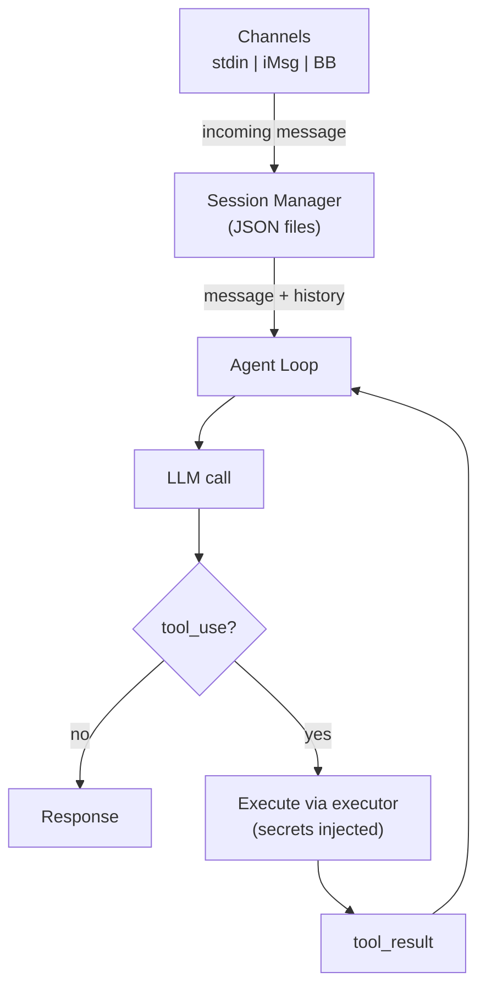

# Agent Mode

In agent mode, the same security boundary applies — the LLM requests tool calls, but the orchestrator handles secrets injection and executor execution:

Scheduled tasks can also use agent mode by setting `mode: agent` in the task YAML. See [Task Definitions](../configuration/tasks.md) for details.

## How It Works

1. **Message arrives** via a channel (stdin, iMessage, or BlueBubbles)
2. **Session Manager** loads conversation history from a JSON file
3. **Agent Loop** sends the message + history to the LLM
4. If the LLM returns a **tool call**, the orchestrator:
    - Validates the action via [Guardian](guardian.md) (policy engine, coherence check)
    - Injects secrets into the executor environment
    - Executes the tool in isolation (subprocess or container)
    - Returns the result to the LLM for the next iteration
5. When the LLM returns a **text response**, the loop ends and the response is delivered

## Sessions

Sessions are stored as JSON files in `sessions/` (gitignored) and persist conversation history across interactions. Key features:

- **History trimming** — Old messages are removed when the history exceeds `max_history`
- **Summarization** — When `summarize_on_trim` is enabled, old messages are summarized by the LLM before being trimmed
- **TTL-based cleanup** — Stale sessions are automatically cleaned up

See [Agent Configuration](../configuration/agent-config.md) for session settings.

## Workspace Memory

The agent has a file-based memory system that persists across sessions:

- `workspace/memory/YYYY-MM-DD.md` — Daily append-only logs written by the agent's `remember` tool
- `workspace/MEMORY.md` — Curated long-term memory updated by `update_long_term_memory`

Recent daily logs and long-term memory are injected into the system prompt automatically.

## Channels

Creel supports multiple input/output channels:

| Channel | Description | Usage |
|---------|-------------|-------|
| **stdin** | Interactive CLI (default) | `creel chat` |
| **iMessage** | Polls local `chat.db` | `creel daemon start` |
| **BlueBubbles** | REST API for iMessage | `creel daemon start --channel bluebubbles` |
| **Telegram** | Polling or webhook | `creel daemon start --channel telegram` |
| **WhatsApp** | Polling or webhook | `creel daemon start --channel whatsapp` |

See [Channels](channels.md) for architecture details.

The TUI (`creel attach`) provides a rich interactive interface with commands like `/help`, `/new`, `/sessions`, and `/resume`.
