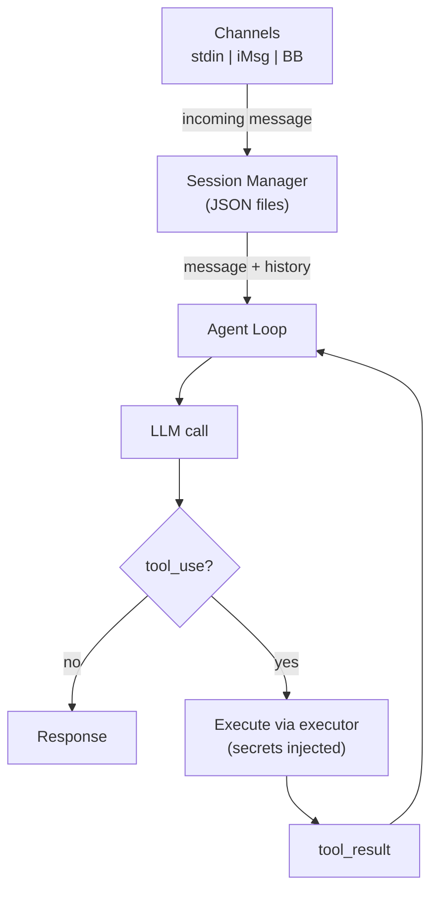

# Agent Mode

In agent mode, the same security boundary applies — the LLM requests tool calls, but the orchestrator handles secrets injection and executor execution:

Scheduled tasks can also use agent mode by setting `mode: agent` in the task YAML. See [Task Definitions](../configuration/tasks.md) for details.

## How It Works

1. **Message arrives** via a channel (stdin, iMessage, or BlueBubbles)
2. **Session Manager** loads conversation history from a JSON file
3. **Agent Loop** sends the message + history to the LLM
4. If the LLM returns a **tool call**, the orchestrator:
    - Validates the action via [Guardian](guardian.md) (policy engine, coherence check)
    - Injects secrets into the executor environment
    - Executes the tool in isolation (subprocess or container)
    - Returns the result to the LLM for the next iteration
5. When the LLM returns a **text response**, the loop ends and the response is delivered

## Sessions

Sessions are stored as JSON files in `sessions/` (gitignored) and persist conversation history across interactions. Key features:

- **History trimming** — Old messages are removed when the history exceeds `max_history`
- **TTL-based cleanup** — Stale sessions are automatically cleaned up
- **Full history preservation** — The on-disk session always contains the complete conversation history

See [Agent Configuration](../configuration/agent-config.md) for session settings.

## Context Window Management

Creel uses a two-layer approach to manage the LLM context window:

### Transient Pruning (automatic)

When `context_pruning.enabled` is set, the agent loop automatically prunes a **copy** of the message history before each LLM call. The full history is never modified — pruning only affects what the model sees for that request.

Each message is scored as `base_weight × recency_decay`. Base weights prioritize tool results (2.0) over user text (1.5) over assistant text (1.0). Recency uses exponential decay with a half-life of 8 messages — recent messages of any type are kept, while older assistant prose is pruned before older tool results. Conversation summaries are never pruned. Tool-call pairs (assistant `tool_use` + user `tool_result`) are never split. Pruning triggers at 80% of the model's context window and prunes down to 60% to create headroom. See [Agent Configuration](../configuration/agent-config.md#context-pruning) for the full scoring table.

### Persistent Compaction (explicit)

The `/compact` command lets users explicitly summarize older context. Unlike transient pruning, this rewrites the on-disk session — older messages are replaced with an LLM-generated summary. This is useful when a conversation is very long and you want to permanently condense it.

## Commands

The TUI (`creel attach`) and chat mode support these slash commands:

| Command | Description |
|---------|-------------|
| `/new` | Start a new session (archives the current one) |
| `/sessions` | List all sessions |
| `/resume <id>` | Resume a previous session |
| `/compact` | Summarize older messages to free up context |
| `/status` | Show server status |
| `/model` | Show current model config |
| `clear` / `/clear` | Clear the active session |

## Workspace Memory

The agent has a file-based memory system that persists across sessions:

- `workspace/memory/YYYY-MM-DD.md` — Daily append-only logs written by the agent's `remember` tool
- `workspace/MEMORY.md` — Curated long-term memory updated by `update_long_term_memory`

Recent daily logs and long-term memory are injected into the system prompt automatically.

## Channels

Creel supports multiple input/output channels:

| Channel | Description | Usage |
|---------|-------------|-------|
| **stdin** | Interactive CLI (default) | `creel chat` |
| **iMessage** | Polls local `chat.db` | `creel daemon start` |
| **BlueBubbles** | REST API for iMessage | `creel daemon start --channel bluebubbles` |
| **Telegram** | Polling or webhook | `creel daemon start --channel telegram` |
| **WhatsApp** | Polling or webhook | `creel daemon start --channel whatsapp` |

See [Channels](channels.md) for architecture details.

The TUI (`creel attach`) provides a rich interactive interface with commands like `/help`, `/new`, `/sessions`, `/resume`, and `/compact`.
