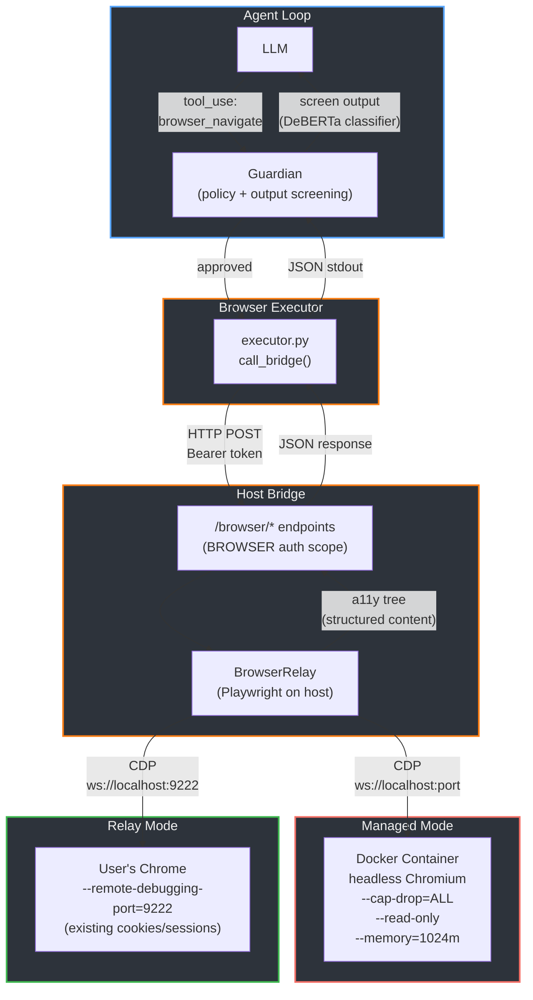
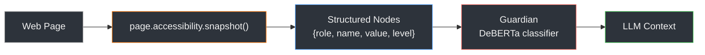
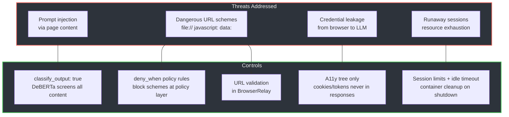
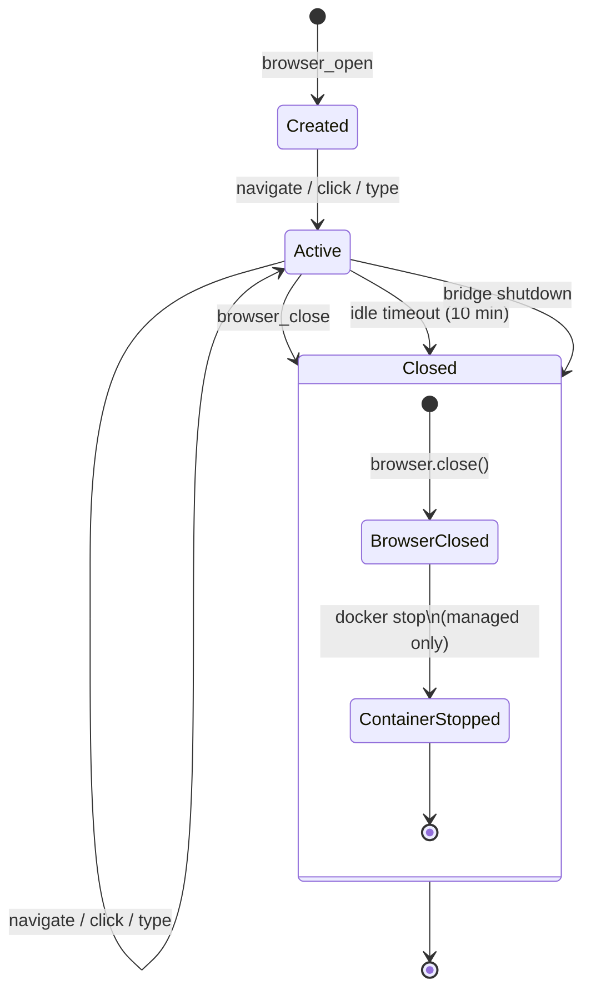

# Browser Tool

Interactive web browsing via Playwright CDP. Supports three modes: **managed** (isolated headless Chromium in Docker), **relay** (user's existing Chrome with logged-in sessions), and **native** (local Chrome/Chromium subprocess).

## Architecture



## Modes

### Managed (default)

Bridge spawns a Docker container running headless Chromium with `--remote-debugging-port`. Playwright on the host connects over CDP. Container provides full filesystem/network isolation.

```
browser_open(mode="managed")
  → bridge starts Docker container (zenika/alpine-chrome)
  → maps random host port to container port 9222
  → Playwright connects via CDP
  → returns session_id
```

Container security matches Creel's other executors: `--cap-drop=ALL`, `--read-only`, `--memory=1024m`, `--cpus=1.0`.

### Native

Bridge launches a local Chrome/Chromium subprocess with `--headless` and `--remote-debugging-port`. No Docker required — useful for development or when Docker isn't available.

```
browser_open(mode="native")
  → bridge spawns local Chrome with headless flags
  → Playwright connects via CDP
  → returns session_id
```

### Relay

Playwright connects to the user's Chrome (launched with `--remote-debugging-port=9222`). Useful for accessing authenticated dashboards where the user is already logged in.

```
browser_open(mode="relay", cdp_url="http://localhost:9222")
  → Playwright connects to existing Chrome via CDP
  → returns session_id
```

## Data Flow

The LLM never sees raw HTML. All content-returning tools use the **accessibility tree** — a structured representation of the page (headings, links, buttons, text inputs) that is token-efficient (~500-2K tokens per page vs 10-50K for raw HTML).



Example accessibility tree output:
```json
[
  {"role": "heading", "name": "Search Results", "level": 1},
  {"role": "link", "name": "First result", "level": 2},
  {"role": "link", "name": "Second result", "level": 2},
  {"role": "textbox", "name": "Search", "value": "query", "level": 1}
]
```

## Tools

| Tool | Action | Policy | Screened | Purpose |
|------|--------|--------|----------|---------|
| `browser_open` | connect | review | no | Create session |
| `browser_navigate` | navigate | review | yes | Go to URL, return content |
| `browser_get_content` | content | allow | yes | Re-read current page |
| `browser_click` | click | review | yes | Click element |
| `browser_type` | type | review | yes | Fill input field |
| `browser_screenshot` | screenshot | review | yes | Capture page as PNG |
| `browser_links` | links | allow | yes | List all page links |
| `browser_close` | close | allow | no | End session |

## Security



- **Output screening**: All content-returning tools set `classify_output: true` — Guardian's DeBERTa classifier checks for prompt injection before content reaches the LLM.
- **URL blocking**: `file://`, `javascript:`, `data:` schemes are blocked at both the policy layer (`deny_when` rules) and in `BrowserRelay._validate_url()`. Configurable domain blocklist.
- **Credential isolation**: Browser state (cookies, sessions) stays in the browser process. Only the accessibility tree reaches the executor — cookies and auth tokens never appear in bridge responses.
- **Container isolation** (managed mode): Chromium runs with `--cap-drop=ALL`, `--read-only`, memory/CPU limits.
- **Session lifecycle**: Max session limit (default 3), idle timeout (default 10 min) with automatic cleanup. All sessions and containers cleaned up on bridge shutdown.

## Session Lifecycle



## Configuration

```yaml
# agent.yaml
browser:
  enabled: true
  default_mode: managed       # "managed" | "relay" | "native"
  cdp_url: "http://localhost:9222"  # for relay mode
  max_sessions: 3
  session_timeout_minutes: 10
```

## Installation

Playwright is an optional dependency:

```bash
uv pip install -e ".[browser]"
playwright install chromium
```

For managed mode, Docker is required (same as other Creel executors).
