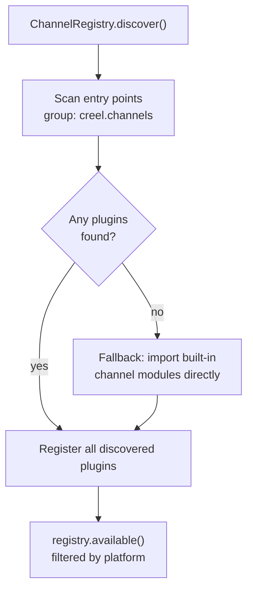

# Channels

Channels are the I/O boundary between external messaging platforms and the agent loop. Each channel is a plugin that knows how to receive messages from one platform (iMessage, Telegram, WhatsApp, etc.) and deliver responses back.

Channels run inside the daemon process — each in its own thread — and feed messages into the same `ChatServer` / agent loop that handles all other interactions.

## Plugin Discovery

The registry uses a two-phase discovery strategy: packaging-based entry points first, with a direct-import fallback for development setups.



**Entry points** are declared in `pyproject.toml`:

```toml
[project.entry-points."creel.channels"]
imessage = "taskrunner.channels.imessage:register_plugin"
bluebubbles = "taskrunner.channels.bluebubbles:register_plugin"
whatsapp = "taskrunner.channels.whatsapp:register_plugin"
telegram = "taskrunner.channels.telegram:register_plugin"
```

When entry points aren't available (e.g. running from source with `PYTHONPATH`), the registry falls back to directly importing the modules listed in `ChannelRegistry._BUILTIN_CHANNELS`.

## Plugin Anatomy

Every channel module exposes a `register_plugin()` function that returns a `(ChannelPluginMeta, factory)` tuple. Here's the Telegram channel as an example:

```python
def register_plugin():
    meta = ChannelPluginMeta(
        id="telegram",
        label="Telegram",
        capabilities=(
            ChannelCapability.POLLING
            | ChannelCapability.WEBHOOK
            | ChannelCapability.SEND
            | ChannelCapability.TYPING_INDICATOR
            | ChannelCapability.GROUP_CHAT
        ),
        config_schema=TelegramChannelConfig,
    )

    def factory(config: dict[str, Any]) -> TelegramChannel:
        cfg = TelegramChannelConfig(**config)
        bridge = HttpTelegramBridge(cfg.bot_token)
        return TelegramChannel(bridge=bridge, mode=cfg.mode, ...)

    return meta, factory
```

The **meta** object (`ChannelPluginMeta`) is an immutable dataclass describing the plugin:

| Field | Type | Purpose |
|-------|------|---------|
| `id` | `str` | Unique identifier (e.g. `"telegram"`) — matches the `--channel` CLI flag |
| `label` | `str` | Human-readable name |
| `capabilities` | `ChannelCapability` | Bitfield of declared capabilities |
| `config_schema` | `type[BaseModel] \| None` | Pydantic model for channel-specific config |
| `priority` | `int` | Lower = loaded first when multiple channels compete (default: 100) |
| `platform` | `str \| None` | OS constraint (e.g. `"darwin"`); `None` means any platform |
| `extras` | `list[str]` | pip extras required (e.g. `["whatsapp"]`) |

The **factory** is a callable that takes a raw config dict (from `agent.yaml`) and returns a `Channel` instance.

## Capabilities

Each plugin declares which features it supports via `ChannelCapability` flags:

| Flag | Meaning |
|------|---------|
| `POLLING` | Can long-poll for new messages |
| `WEBHOOK` | Can receive messages via HTTP webhook |
| `SEND` | Can send outbound messages |
| `MEDIA` | Supports media attachments |
| `REACTIONS` | Can send/receive reactions |
| `READ_RECEIPTS` | Supports read receipts |
| `TYPING_INDICATOR` | Can send typing indicators |
| `GROUP_CHAT` | Supports group conversations |
| `WAIT_FOR_REPLY` | Can block waiting for a specific sender's reply |

### Current channels

| Channel | POLLING | WEBHOOK | SEND | TYPING | GROUP | WAIT_FOR_REPLY | Platform | Extras |
|---------|:-------:|:-------:|:----:|:------:|:-----:|:--------------:|----------|--------|
| **iMessage** | x | | x | | | x | `darwin` | |
| **BlueBubbles** | x | | x | | | | | |
| **Telegram** | x | x | x | x | x | | | |
| **WhatsApp** | x | x | x | | | | | `whatsapp` |

## Channel Lifecycle

```mermaid
flowchart LR
    D["discover()"] --> REG["ChannelRegistry"]
    REG -- "create_channel(id, config)" --> CH["Channel instance"]
    CH -- "register_channel()" --> SVC["DaemonService"]
    SVC -- "start_channel()" --> T["Daemon thread"]
    T -- "channel.listen(callback)" --> LOOP["Poll / webhook loop"]
    LOOP -- "callback(sender, text)" --> AGENT["Agent loop\n(ChatServer)"]
    AGENT -- "channel.send()" --> OUT["Outbound message"]
```



1. **Discovery** — `ChannelRegistry.discover()` scans entry points (or built-in imports) and registers all found plugins.
2. **Instantiation** — `registry.create_channel(channel_id, config)` calls the plugin factory with config from `agent.yaml`.
3. **Registration** — `DaemonService.register_channel()` stores the channel instance.
4. **Thread start** — `DaemonService.start_channel()` spawns a daemon thread that calls `channel.listen(callback)`.
5. **Message loop** — The channel polls or waits for webhooks, calling `callback(sender_id, text)` for each inbound message. The callback routes through the agent loop and returns a response string.
6. **Outbound** — The channel's `send()` method delivers the response back to the platform.

## Access Control

Channels enforce allow-list filtering on both inbound and outbound messages. This is configured in `agent.yaml` under each channel's section.

### Inbound filtering

Messages are dropped unless the sender matches `allowed_senders`. For group-capable channels like Telegram, `allowed_chats` additionally restricts which groups the bot responds in.

```yaml
channels:
  telegram:
    bot_token: ${TELEGRAM_BOT_TOKEN}
    allowed_senders: ["12345678", "@myusername"]
    allowed_chats: ["-100987654"]
```

!!! warning "Mandatory allow-list"
    If `allowed_senders` is empty or omitted, **all inbound messages are rejected**. There is no open-to-all mode — this is a deliberate security default.

### Outbound filtering

Outbound `send()` calls are restricted to the union of `allowed_chats` and numeric IDs from `allowed_senders`. Chat IDs for senders who pass inbound filtering are also added dynamically during the session.

## Adding a New Channel

1. Create `src/taskrunner/channels/<name>.py` implementing the `Channel` ABC (`listen`, `send`, `stop`).
2. Add a `register_plugin()` function returning `(ChannelPluginMeta, factory)`.
3. Add a Pydantic config model in `src/taskrunner/models.py`.
4. Register the entry point in `pyproject.toml` under `[project.entry-points."creel.channels"]`.
5. Add the module path to `ChannelRegistry._BUILTIN_CHANNELS` for dev fallback.
6. Add channel config to `agent.yaml` under `channels:`.
7. Run the test suite: `.venv/bin/python -m pytest tests/ -v`.
