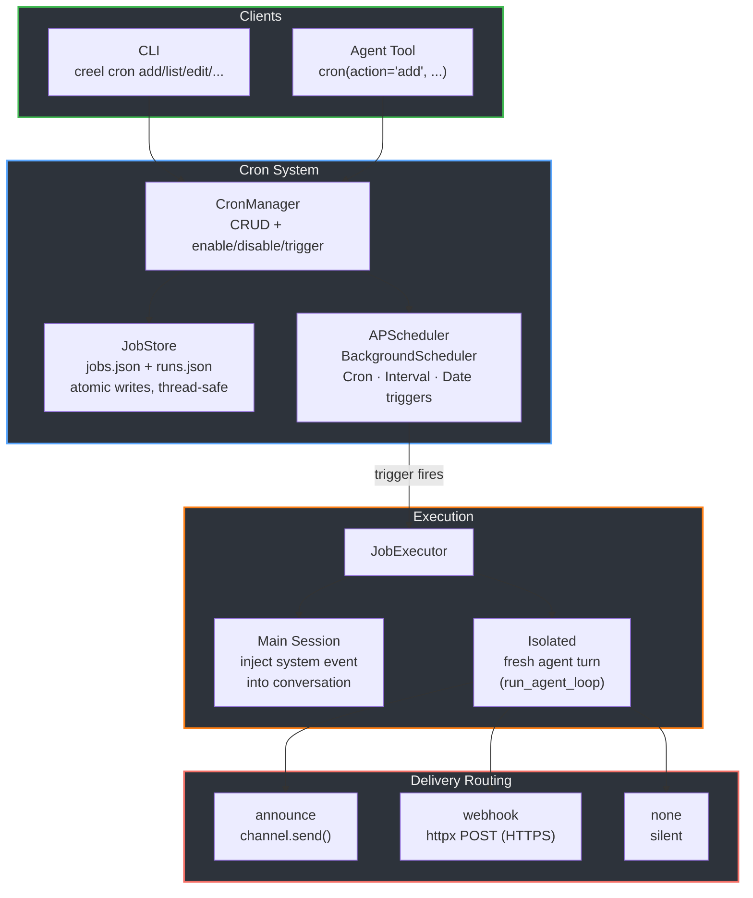
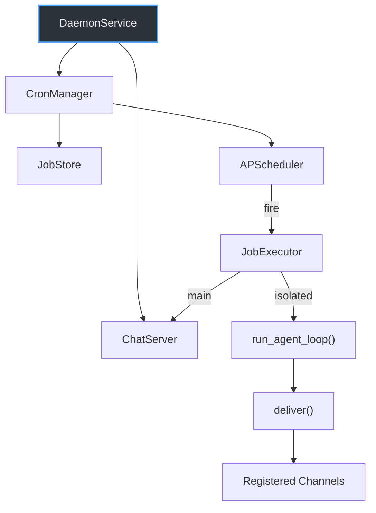

# Cron / Scheduled Jobs

Dynamic job scheduling with runtime management, persistence, and delivery routing. Jobs can be created via CLI or the agent's `cron` tool — no file editing required.

## Architecture



## Schedule Types

| Type | Trigger | Use case | Example |
|------|---------|----------|---------|
| `cron` | `CronTrigger` | Recurring on a schedule | `"0 8 * * *"` (daily 8am) |
| `every` | `IntervalTrigger` | Fixed interval | `"300"` (every 5 minutes) |
| `at` | `DateTrigger` | One-shot at a specific time | `"2026-03-01T09:00:00-07:00"` |

One-shot (`at`) jobs auto-delete after success (run history is preserved). Past timestamps fire immediately via `misfire_grace_time=None`.

## Execution Modes

**Main session** — injects a system event into the active conversation via `ChatServer.inject_system_event()`. The agent sees it on its next turn. Rate-limited to 10 events per sender per 60 seconds.

**Isolated** — runs a fresh agent turn via `run_agent_loop()` with its own session. Supports model override (`payload.model`). Output is routed through delivery. Credentials are inherited from the daemon process environment (same as the main session).

## Delivery (isolated jobs only)

| Mode | Behavior | Security |
|------|----------|----------|
| `announce` | Send output to a named chat channel | Channel must exist in DaemonService |
| `webhook` | POST JSON to a URL | HTTPS required, private/loopback IPs blocked, redirects disabled |
| `none` | Run silently, log result only | — |

When `best_effort` is true (default), delivery failures are logged but don't fail the job.

## Persistence

```
~/.creel/cron/
├── jobs.json    # List of CronJob definitions
└── runs.json    # Map of job_id → RunRecord[] (capped at 50 per job)
```

Both files use atomic writes (temp file + `os.replace`). `JobStore` is thread-safe via `threading.Lock`. Corrupt files are logged and treated as empty on startup — the daemon still boots.

## Data Model

```
CronJob
├── id: str (uuid4 hex, 12 chars)
├── name: str
├── schedule: Schedule {kind, expr, tz}
├── target: "main" | "isolated"
├── payload: Payload {kind, message, model?, timeout_seconds}
├── delivery: Delivery {mode, channel?, url?, best_effort}
├── enabled: bool
├── created_at / updated_at: ISO 8601
```

```
RunRecord
├── job_id: str
├── started_at / ended_at: ISO 8601
├── status: "success" | "failure"
├── error: str?
```

## Daemon Integration



On startup, `DaemonService`:

1. Creates `JobStore` (loads `jobs.json` + `runs.json`)
2. Creates `JobExecutor` with agent definition, event injector, and channel sender
3. Creates `CronManager` with store + executor
4. Starts the scheduler — enabled jobs begin firing

On shutdown, the cron manager is stopped before channels to ensure in-flight deliveries complete.

**Thread pool caveat**: Job callbacks run in APScheduler's thread pool (~10-20 threads by default). Long-running executors (e.g., full agent loops) block their thread for the duration, so many concurrent long-running jobs could exhaust the pool and delay other jobs from firing. Consider offloading to a dedicated executor if this becomes a bottleneck.

## CLI

```
creel cron list                          # all jobs with status, schedule, last run
creel cron add --name "..." --cron "..." --message "..."
creel cron add --name "..." --at "..." --system-event "..."
creel cron edit <job-id> --disable
creel cron remove <job-id>
creel cron run <job-id>                  # trigger immediately
creel cron runs <job-id>                 # show run history
```

## Agent Tool

The `cron` tool is registered as a built-in tool (like memory tools) with actions: `list`, `add`, `update`, `remove`, `run`, `runs`. This lets the agent schedule its own reminders and background tasks conversationally.

## Security

- **Webhook SSRF protection**: HTTPS required, `ipaddress` module blocks private/loopback/link-local/reserved IPs, `follow_redirects=False` prevents redirect-based bypass. DNS rebinding not covered (would require resolution-time checks).
- **Event injection rate limiting**: `ChatServer.inject_system_event()` caps at 10 events per sender per 60 seconds to prevent runaway main-session jobs from flooding the conversation.
- **Credentials**: Isolated jobs inherit credentials from the daemon process environment — no per-job secret loading needed.
- **Timezone validation**: All timezones validated against `zoneinfo.ZoneInfo` (IANA database).
- **Cron expression validation**: Validated via `APScheduler.CronTrigger.from_crontab()` at model construction time.

## Code Layout

```
src/taskrunner/cron/
├── __init__.py      # Package exports
├── models.py        # CronJob, Schedule, Payload, Delivery, RunRecord (Pydantic v2)
├── store.py         # JobStore — JSON persistence, atomic writes, thread-safe
├── manager.py       # CronManager — wraps JobStore + APScheduler
├── executor.py      # JobExecutor — main-session injection or isolated agent turns
├── delivery.py      # Output routing — announce / webhook / none
└── tool.py          # Agent tool definition (CRON_TOOL_DEFINITION) and handler
```
