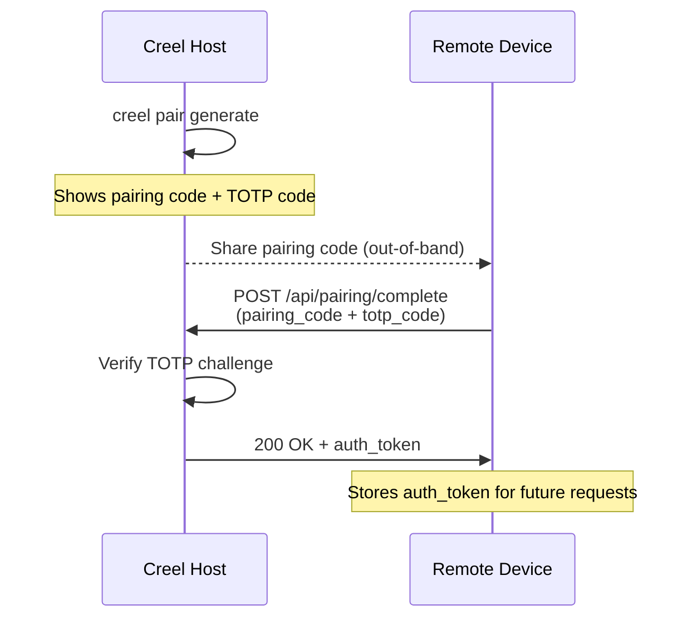

# Device Pairing

Device pairing lets a Creel instance securely pair with mobile devices or other machines for capabilities like push notifications, camera access, location, clipboard sync, and remote command execution (with approval).

## Pairing Flow



1. The host generates a pairing session via the CLI or API
2. The host shares the 8-character pairing code with the device out-of-band (verbally, screen share, etc.)
3. The host reads the TOTP verification code displayed on screen and provides it to the device
4. The device submits both codes to the `/api/pairing/complete` endpoint
5. On success, the device receives an `auth_token` for future authenticated requests

!!! info "TOTP secret stays server-side"
    The TOTP secret is never exposed via the HTTP API. The host user reads the current 6-digit TOTP code from the CLI output and communicates it out-of-band. This prevents a network observer from obtaining both the pairing code and the TOTP answer from a single intercepted response.

## Security Model

| Layer | Mechanism |
|-------|-----------|
| **Pairing code** | 8-character random hex (`secrets.token_hex`), shared out-of-band |
| **TOTP challenge** | RFC 6238 HMAC-SHA1, ±1 step window (30s), 3 attempts max |
| **Auth token** | 32-byte `secrets.token_urlsafe`, returned once at pairing completion |
| **Token verification** | Constant-time comparison (`hmac.compare_digest`) |
| **File permissions** | Directories `0o700`, device/session files `0o600` |
| **Path traversal** | IDs validated against `^[a-f0-9]+$` before any file access |
| **Session limits** | Max 10 concurrent pending sessions, configurable timeout (1s–24h) |

!!! tip "Brute-force protection"
    Failed TOTP attempts are tracked per session. After 3 failures, the session is permanently rejected. Combined with the session timeout (default 5 minutes), this limits the attack window.

## CLI Usage

```bash
# Generate a new pairing code
creel pair generate
creel pair generate --timeout 120  # custom timeout in seconds

# List all paired devices
creel pair list

# Remove a paired device
creel pair remove <device_id>

# Test connectivity to a paired device
creel pair test <device_id>
```

Example output from `creel pair generate`:

```
Device Pairing Code
========================================
  Code:    A1B2C3D4
  Session: f51060404b8899a805e94d913f1a62b6

  TOTP verification code: 482901

  Expires in 300 seconds.

Share the pairing code with the device to pair.
```

## REST API

All HTTP endpoints require the dashboard auth token (Bearer header or `?token=` query parameter). The WebSocket endpoint handles its own token authentication.

### Generate Pairing Session

```
POST /api/pairing/generate?timeout_seconds=300
```

**Response:**

```json
{
  "session_id": "f51060404b8899a805e94d913f1a62b6",
  "pairing_code": "A1B2C3D4",
  "expires_at": 1774011838.35
}
```

### Complete Pairing

```
POST /api/pairing/complete
```

**Request body:**

```json
{
  "pairing_code": "A1B2C3D4",
  "totp_code": "482901",
  "device_name": "My iPhone",
  "device_type": "phone",
  "capabilities": ["push_notifications", "camera"]
}
```

**Response (200):**

```json
{
  "id": "ab1234...",
  "name": "My iPhone",
  "device_type": "phone",
  "capabilities": ["push_notifications", "camera"],
  "last_seen": 1773925438.35,
  "paired_at": 1773925438.35,
  "auth_token": "dGhpcyBpcyBhIHRva2Vu..."
}
```

!!! warning "Store the auth token"
    The `auth_token` is returned **only once** in the complete response. The device must persist it for future authenticated requests.

**Error responses:**

| Status | Meaning |
|--------|---------|
| 404 | Invalid or expired pairing code |
| 403 | TOTP verification failed |
| 422 | Validation error (bad field lengths) |
| 429 | Too many pending pairing sessions |

### List Devices

```
GET /api/pairing/devices
```

### Get Device

```
GET /api/pairing/devices/{device_id}
```

### Remove Device

```
DELETE /api/pairing/devices/{device_id}
```

### WebSocket — Pairing Status

```
WS /ws/pairing/{session_id}?token=<dashboard_token>
```

Streams real-time status updates while waiting for a remote device to complete pairing. Messages are JSON objects:

```json
{"session_id": "...", "status": "pending", "device_name": "", "expires_at": 1774011838.35}
```

The connection closes automatically when the session reaches a terminal state (`paired`, `expired`, or `rejected`).

## Device Types and Capabilities

**Device types:** `phone`, `tablet`, `desktop`, `laptop`, `other`

**Capabilities:**

| Capability | Description |
|------------|-------------|
| `push_notifications` | Device can receive push notifications |
| `camera` | Camera access for photos/scanning |
| `location` | GPS/location sharing |
| `clipboard` | Clipboard sync between devices |
| `remote_exec` | Remote command execution (requires approval) |

## Data Storage

Pairing data is stored as JSON files under `~/.creel/pairing/`:

```
~/.creel/pairing/
├── devices/
│   └── <device_id>.json    # paired device records (0o600)
└── sessions/
    └── <session_id>.json   # pairing sessions (0o600)
```

Expired sessions are cleaned up by `PairingManager.cleanup_expired_sessions()`, which deletes their files from disk.
