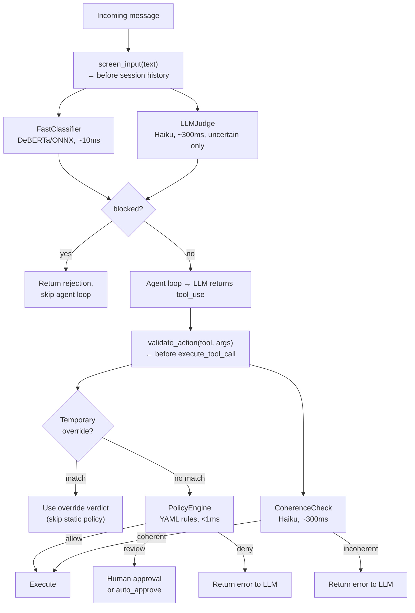
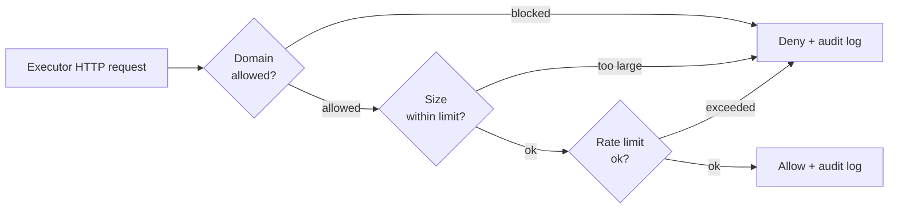

# Guardian Security

The Guardian layer screens inputs and validates tool calls before they execute. All stages are optional and independently configurable in `agent.yaml`.

## Pipeline



## Stages

| Stage | Component | What it does |
|-------|-----------|--------------|
| 1 | Fast classifier | Local DeBERTa model scores prompt-injection likelihood against a confidence threshold |
| 2 | LLM judge | Secondary Haiku-based check (enabled by default, fires only when classifier is uncertain) |
| 3a | Temporary overrides | Time-limited allow/deny rules checked before static policy (`/allow`, `/deny` commands) |
| 3b | Policy engine | `fnmatch` rules in `policies/default.yaml` map tool names to allow/review/deny |
| 4 | Coherence check | LLM-based check that tool calls match the user's original intent (disabled by default, opt-in) |
| 5 | Credential scanner | Scans tool output for leaked credentials before returning results to the LLM |
| 6 | Drift detection | Detects when agent behavior drifts from the user's original intent over multi-turn conversations |
| 7 | Network policy | Domain allowlist/blocklist, request/response size limits, and per-executor rate limiting for outbound HTTP requests |

## Policy Rules

Policy rules are defined in `policies/default.yaml`:

```yaml
allow:
  - check_weather
  - check_calendar
  - check_email
  - read_email
  - check_drive
  - read_doc
  - read_sheet
  - notion_api
  - check_messages
  - get_chats
  - react_imessage
  - list_notes
  - search_notes
  - read_clipboard
  - github
  - web_search
  - fetch_url
  - synthesize_speech
  - remember
  - search_memory
  # ... 40+ read-only tools total

review:
  - send_*
  - upload_*
  - create_*
  - mark_*
  - trash_*
  - write_clipboard
  - host_exec
  - host_process
  - dev_exec
  - dev_process
  - coding
  - exec_interactive
  - git_commit
  - git_push
  - notion_write
  # ... plus browser, file ops, etc.

deny:   [delete_*]

# Conditional deny rules block dangerous shell patterns
# (rm -rf, reverse shells, fork bombs, pipe injection, etc.)
# Applied to exec, host_exec, dev_exec, coding, exec_interactive
deny_when:
  - tool: exec
    arg: command
    pattern: "*rm -rf*"
  # ... 100+ patterns across all exec-like tools

auto_approve:
  - mark_read
  - react_imessage
  - remember
  - write_clipboard
  - create_note
  - create_reminder
  - browser_open
  - browser_navigate
  - write_file
  - edit_file
  # ... 20+ tools that skip human confirmation
```

Deny wins over review, review wins over allow. Unknown tools default to review. Tools listed in `auto_approve` skip the human confirmation prompt even when matched by a review rule.

## Temporary Overrides

Temporary overrides let you pre-approve (or block) tool patterns for a limited time, avoiding repeated approval prompts during batch work. Overrides are checked **before** the static policy — if a match is found, the static policy is skipped entirely.

### Commands

| Command | Description |
|---------|-------------|
| `/allow <pattern> [Nx] [duration]` | Auto-approve matching tools for a duration (default 30m). Optional `Nx` limits to N uses. |
| `/deny <pattern>` | Revoke an active override |
| `/allows` | List all active overrides with remaining time and usage |

Examples:

```
/allow weather 5m           # auto-approve weather for 5 minutes
/allow github.* 10x 1h     # auto-approve github tools, max 10 uses, 1 hour
/allow gmail_send 30m       # auto-approve gmail sends for 30 minutes
/deny gmail_send            # revoke the gmail_send override
/allows                     # list what's active
```

### Safety Guardrails

- **Excluded tools**: Patterns matching `delete_*` (configurable) are always rejected, even via broad globs like `del*` or `*`.
- **Deny wins**: If both an allow and deny override match, deny takes priority.
- **Duration cap**: Overrides cannot exceed `absolute_max_duration_hours` (default 24h).
- **Wildcard confirmation**: `/allow *` requires appending `confirm` to proceed.
- **Audit trail**: All override lifecycle events (create, hit, revoke, expire) are logged.

### Configuration

```yaml
guardian:
  overrides:
    enabled: true
    absolute_max_duration_hours: 24.0
    excluded_tools: ["delete_*"]
    require_confirmation_for_wildcard: true
```

## Human-in-the-Loop Review

Tools matching `review` rules prompt the user for approval before executing. In the TUI, this appears as an inline confirmation dialog. A configurable timeout (default 60s) denies the action if no response is received.

## Network Policy

The network policy monitors and controls outbound HTTP requests made by executors. When enabled, every executor network call is checked against domain, size, and rate limits before it executes.



### Domain Matching

Domains are matched using suffix-based rules with proper subdomain boundaries:

- `*.googleapis.com` matches `storage.googleapis.com` and `a.b.googleapis.com`
- `*.googleapis.com` does **not** match `evilgoogleapis.com` or `googleapis.com` itself
- Exact patterns like `api.openai.com` match only that domain

Evaluation order:

1. **Blocked domains** — if matched, deny immediately
2. **Allowed domains** — if the list is non-empty and matched, allow
3. If allowed list is non-empty and not matched, deny (unknown domain)
4. If allowed list is empty, allow (permissive mode)

### Configuration

```yaml
guardian:
  network_policy:
    enabled: true
    allowed_domains:
      - "*.googleapis.com"
      - "api.openai.com"
      - "api.anthropic.com"
    blocked_domains:
      - "*.pastebin.com"
      - "*.ngrok.io"
    max_request_size_mb: 10     # max outbound request body
    max_response_size_mb: 50    # alert on oversized responses
    rate_limit_per_minute: 100  # per-executor sliding window
    alert_on_unknown: true      # log unknown domains
```

| Field | Default | Description |
|-------|---------|-------------|
| `enabled` | `false` | Enable network monitoring |
| `allowed_domains` | `[]` | Domain allowlist (empty = permissive) |
| `blocked_domains` | `[]` | Domain blocklist (checked first) |
| `max_request_size_mb` | `10` | Max request body size in MB |
| `max_response_size_mb` | `50` | Max response body size in MB |
| `rate_limit_per_minute` | `100` | Per-executor request limit (60s sliding window) |
| `alert_on_unknown` | `true` | Log alerts for unknown domains |

!!! warning
    When `allowed_domains` is empty, all non-blocked domains are permitted. Add an allowlist to restrict executors to known API endpoints only.

### Audit

Network requests are logged to `guardian_audit.jsonl` as `network_request` events. Blocked requests and oversized responses generate additional `network_alert` events. URLs are sanitized (query strings and fragments stripped) before logging to prevent sensitive parameters from being persisted.

Use the CLI to inspect network logs:

```bash
creel network log              # last 20 network requests
creel network log --tail 50    # last 50
creel network log --executor gmail_readonly
creel network policy           # show current policy
creel network allow api.openai.com   # test if a domain is allowed
creel network block evil.com         # test if a domain is blocked
```

## Audit Logging

Audit logging writes to `guardian_audit.jsonl` with hashed inputs (never raw text), tool names, arg keys (not values), verdicts, and confidence scores.

## Configuration

```yaml
guardian:
  enabled: true
  review:
    timeout_seconds: 60
    default_on_timeout: deny
  fast_classifier:
    enabled: true
    threshold: 0.85
    model_name: protectai/deberta-v3-base-prompt-injection-v2
  llm_judge:
    enabled: true
    uncertain_only: true
  coherence:
    enabled: false
    model: claude-haiku-4-5
    max_tokens: 256
  policy:
    enabled: true
    policy_file: policies/default.yaml
  audit:
    enabled: true
    log_file: guardian_audit.jsonl
  network_policy:
    enabled: false
  overrides:
    enabled: true
    absolute_max_duration_hours: 24.0
    excluded_tools: ["delete_*"]
    require_confirmation_for_wildcard: true
```
