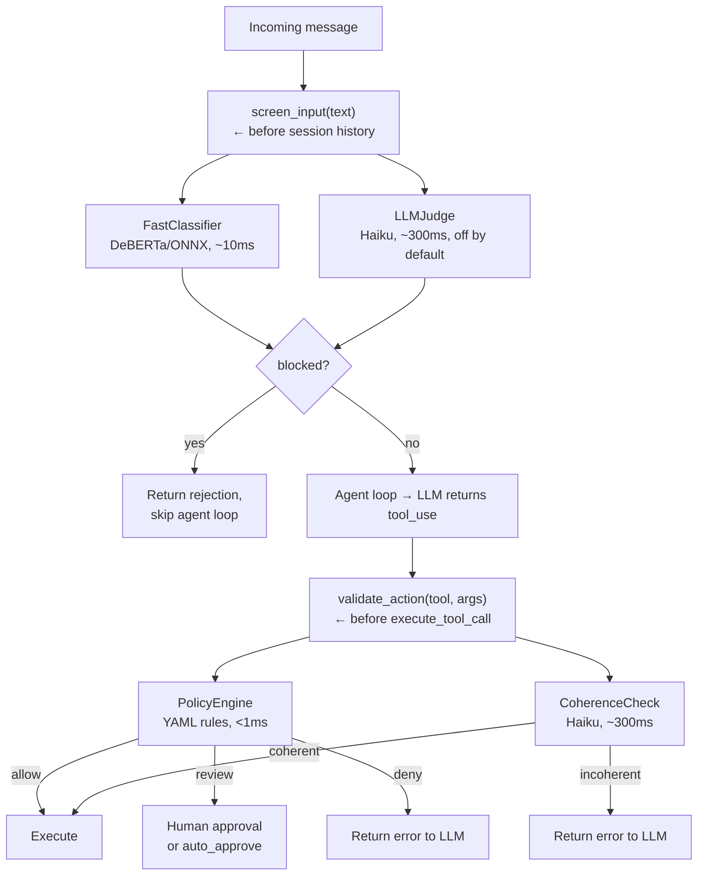

# Guardian Security

The Guardian layer screens inputs and validates tool calls before they execute. All stages are optional and independently configurable in `agent.yaml`.

## Pipeline



## Stages

| Stage | Component | What it does |
|-------|-----------|--------------|
| 1 | Fast classifier | Local DeBERTa model scores prompt-injection likelihood against a confidence threshold |
| 2 | LLM judge | Secondary Haiku-based check (disabled by default) |
| 3 | Policy engine | `fnmatch` rules in `policies/default.yaml` map tool names to allow/review/deny |
| 4 | Coherence check | LLM-based check that tool calls match the user's original intent (catches prompt injection causing unrelated actions) |

## Policy Rules

Policy rules are defined in `policies/default.yaml`:

```yaml
allow:  [check_weather, check_calendar, check_email, read_email, check_drive, check_messages, get_chats, react_imessage]
review: [send_*, upload_*, create_*, mark_*, trash_*]
deny:   [delete_*]

# Tools that match 'review' rules but can skip human approval
auto_approve:
  - mark_read
  - react_imessage
```

Deny wins over review, review wins over allow. Unknown tools default to review. Tools listed in `auto_approve` skip the human confirmation prompt even when matched by a review rule.

## Human-in-the-Loop Review

Tools matching `review` rules prompt the user for approval before executing. In the TUI, this appears as an inline confirmation dialog. A configurable timeout (default 60s) denies the action if no response is received.

## Audit Logging

Audit logging writes to `guardian_audit.jsonl` with hashed inputs (never raw text), tool names, arg keys (not values), verdicts, and confidence scores.

## Configuration

```yaml
guardian:
  enabled: true
  review:
    timeout_seconds: 60
    default_on_timeout: deny
  fast_classifier:
    enabled: true
    threshold: 0.95
    model_name: protectai/deberta-v3-base-prompt-injection-v2
  llm_judge:
    enabled: false
  coherence:
    enabled: true
    model: claude-haiku-4-5-20251001
    max_tokens: 256
  policy:
    enabled: true
    policy_file: policies/default.yaml
  audit:
    enabled: true
    log_file: guardian_audit.jsonl
```
