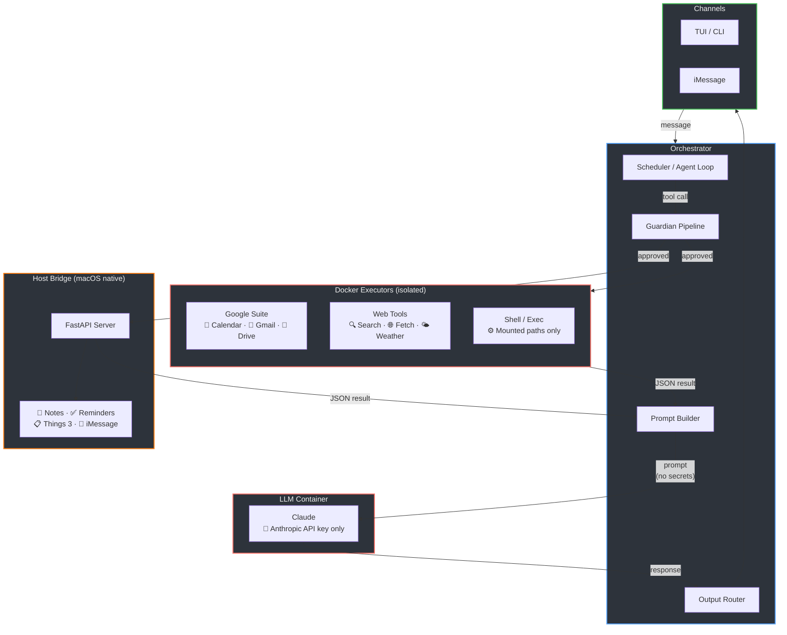

# Architecture Overview

## Why Creel?

Agentic LLM systems give the model access to tools, credentials, and untrusted input all at once. Creel enforces **per-tool isolation** — each executor runs in its own container with only the credentials it needs:

| Component | Has access to | Does NOT have |
|-----------|--------------|---------------|
| Each executor | Only its own credential (one OAuth scope, one API key) | LLM, other tools' credentials |
| Bridge executors | Scoped HTTP token for one macOS app | LLM, other bridge endpoints |
| LLM Runner | Anthropic API key only | Any tool credentials |
| Orchestrator | All secrets, LLM output | Untrusted external input |

Even if prompt injection occurs (e.g., via a calendar event title), the LLM container has nothing to exfiltrate except its own API key. A compromised executor can only access its one scoped credential — not your email, not your files, not your messages.

## System Architecture

!!! info "Key insight"
    Each red box is a separate security boundary. The LLM never sees credentials. Executors only get their own scoped secret. Even a compromised tool can't reach other tools' data.
