# Architecture Overview

## Why Creel?

Agentic LLM systems give the model access to tools, credentials, and untrusted input all at once. Creel preserves the core security property — **the LLM never sees credentials** — whether running scheduled tasks or interactive agent conversations:

| Component | Has access to | Does NOT have |
|-----------|--------------|---------------|
| Executor (gcal) | Google OAuth token (read-only) | LLM, other credentials |
| Executor (gcal_write) | Google OAuth token (calendar.events) | LLM, other credentials |
| Executor (gmail_readonly) | Google OAuth token (read-only) | LLM, other credentials |
| Executor (gmail_send) | Google OAuth token (gmail.send) | LLM, other credentials |
| Executor (gmail_modify) | Google OAuth token (gmail.modify) | LLM, other credentials |
| Executor (drive) | Google OAuth token (read-only) | LLM, other credentials |
| Executor (drive_write) | Google OAuth token (drive.file) | LLM, other credentials |
| Executor (bluebubbles) | BlueBubbles API password | LLM, other credentials |
| Executor (brave_search) | Brave API key | LLM, other credentials |
| Executor (apple_notes) | Bridge HTTP access (scoped token) | LLM, other credentials |
| Executor (apple_reminders) | Bridge HTTP access (scoped token) | LLM, other credentials |
| Executor (things) | Bridge HTTP access (scoped token) | LLM, other credentials |
| Executor (imessage_bridge) | Bridge HTTP access (scoped token) | LLM, other credentials |
| Executor (exec) | Host filesystem (mounted paths only) | LLM, other credentials |
| Executor (fetch_url) | Nothing sensitive | LLM, other credentials |
| Executor (weather) | Nothing sensitive | LLM, other credentials |
| LLM Runner | Anthropic API key | Any other credentials |
| Orchestrator | All secrets, LLM output | Untrusted external input |

Even if prompt injection occurs (e.g., via a calendar event title), the LLM container has nothing to exfiltrate except its own API key.

## System Architecture

```mermaid
flowchart TD
    subgraph orch["Orchestrator"]
        direction TB
        schedule["Cron Scheduler"]
        template["Prompt Template"]
        output["Output Router"]
    end

    subgraph container_execs["Containerized Executors"]
        direction TB
        gcal["Executor: gcal\n🔑 Google OAuth token\n(calendar.readonly)"]
        gcal_w["Executor: gcal_write\n🔑 Google OAuth token\n(calendar.events)"]
        gmail["Executor: gmail_readonly\n🔑 Google OAuth token\n(gmail.readonly)"]
        gmail_s["Executor: gmail_send\n🔑 Google OAuth token\n(gmail.send)"]
        gmail_m["Executor: gmail_modify\n🔑 Google OAuth token\n(gmail.modify)"]
        drive["Executor: drive\n🔑 Google OAuth token\n(drive.readonly)"]
        drive_w["Executor: drive_write\n🔑 Google OAuth token\n(drive.file)"]
        bb["Executor: bluebubbles\n🔑 BlueBubbles API password"]
        brave["Executor: brave_search\n🔑 Brave API key"]
        fetch["Executor: fetch_url\n🔑 None"]
        weather["Executor: weather\n🔑 None"]
        exec["Executor: exec\n🔑 None (mounted paths)"]
    end

    subgraph bridge_execs["Bridge-Proxied Executors"]
        direction TB
        notes["Executor: apple_notes\n🔑 Bridge token"]
        reminders["Executor: apple_reminders\n🔑 Bridge token"]
        things["Executor: things\n🔑 Bridge token"]
        imsg_bridge["Executor: imessage_bridge\n🔑 Bridge token"]
    end

    subgraph bridge["Host Bridge Server"]
        direction TB
        bridge_api["FastAPI Server\n(Host Process)"]
        memo_cli["memo CLI"]
        remindctl_cli["remindctl CLI"]
        things_cli["things CLI"]
        imsg_cli["imsg CLI"]
    end

    subgraph llm_container["Isolated LLM Container"]
        llm["LLM Runner\n🔑 Anthropic API key"]
    end

    subgraph outputs["Delivery"]
        imsg["iMessage"]
        stdout["stdout"]
        file["File"]
    end

    schedule -- "triggers" --> gcal
    schedule -- "triggers" --> gcal_w
    schedule -- "triggers" --> gmail
    schedule -- "triggers" --> gmail_s
    schedule -- "triggers" --> gmail_m
    schedule -- "triggers" --> drive
    schedule -- "triggers" --> drive_w
    schedule -- "triggers" --> bb
    schedule -- "triggers" --> brave
    schedule -- "triggers" --> fetch
    schedule -- "triggers" --> weather
    schedule -- "triggers" --> exec
    schedule -- "triggers" --> notes
    schedule -- "triggers" --> reminders
    schedule -- "triggers" --> things
    schedule -- "triggers" --> imsg_bridge

    gcal -- "JSON" --> template
    gcal_w -- "JSON" --> template
    gmail -- "JSON" --> template
    gmail_s -- "JSON" --> template
    gmail_m -- "JSON" --> template
    drive -- "JSON" --> template
    drive_w -- "JSON" --> template
    bb -- "JSON" --> template
    brave -- "JSON" --> template
    fetch -- "JSON" --> template
    weather -- "JSON" --> template
    exec -- "JSON" --> template

    notes -- "HTTP" --> bridge_api
    reminders -- "HTTP" --> bridge_api
    things -- "HTTP" --> bridge_api
    imsg_bridge -- "HTTP" --> bridge_api

    bridge_api --> memo_cli
    bridge_api --> remindctl_cli
    bridge_api --> things_cli
    bridge_api --> imsg_cli

    notes -- "JSON" --> template
    reminders -- "JSON" --> template
    things -- "JSON" --> template
    imsg_bridge -- "JSON" --> template

    template -- "rendered prompt\n(no secrets)" --> llm
    llm -- "text response" --> output
    output --> imsg
    output --> stdout
    output --> file

    style container_execs fill:#2d333b,stroke:#f47067,stroke-width:2px,color:#f0f0f0
    style bridge_execs fill:#2d333b,stroke:#f47067,stroke-width:2px,color:#f0f0f0
    style bridge fill:#2d333b,stroke:#fd7e14,stroke-width:2px,color:#f0f0f0
    style llm_container fill:#2d333b,stroke:#f47067,stroke-width:2px,color:#f0f0f0
    style orch fill:#2d333b,stroke:#58a6ff,stroke-width:2px,color:#f0f0f0
    style outputs fill:#2d333b,stroke:#3fb950,stroke-width:2px,color:#f0f0f0
```

!!! info "Key insight"
    Even if prompt injection occurs (e.g., via a calendar event title), the LLM container has no access to Google credentials, user contacts, or anything beyond its own API key. Each red box is a separate security boundary.
