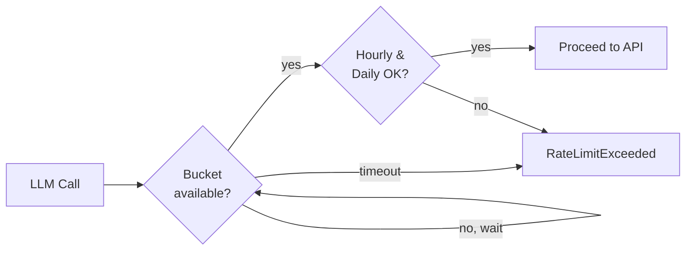

# Rate Limiting

Creel includes built-in rate limiting for LLM API calls to prevent runaway costs from agent loops or misconfigured tasks. Limits are enforced across all LLM paths — direct API calls, container-based, and pooled.

## Configuration

Add a `rate_limits` block under `llm` in your `agent.yaml`:

```yaml
llm:
  model: claude-sonnet-4-20250514
  max_tokens: 1024
  rate_limits:
    enabled: true
    requests_per_minute: 30
    requests_per_hour: 500
    tokens_per_day: 1000000
    cost_per_day_usd: 10.00
    queue_timeout: 30.0
```

!!! info "Disabled by default"
    Rate limiting is **off** unless you explicitly set `enabled: true`. This avoids surprising existing users after an upgrade.

## Parameters

| Parameter | Type | Default | Description |
|-----------|------|---------|-------------|
| `enabled` | bool | `false` | Enable or disable rate limiting |
| `requests_per_minute` | int | `30` | Maximum requests per minute (token bucket) |
| `requests_per_hour` | int | `500` | Maximum requests per rolling hour window |
| `tokens_per_day` | int | `1,000,000` | Maximum input + output tokens per rolling 24 hours |
| `cost_per_day_usd` | float | `10.00` | Maximum estimated cost (USD) per rolling 24 hours |
| `queue_timeout` | float | `30.0` | Seconds to wait for a rate limit slot before failing (0 = fail immediately) |

## How It Works

Rate limiting uses three complementary mechanisms:

- **Token bucket** — Smooths per-minute request bursts. The bucket starts full and refills at a steady rate. When empty, requests block up to `queue_timeout` seconds waiting for a slot.
- **Rolling window (hourly)** — Hard cap on requests in the last 60 minutes. No queuing — exceeding this limit raises an error immediately.
- **Rolling window (daily)** — Hard caps on both token count and estimated cost over the last 24 hours. These are the primary cost-protection guardrails.



## Alerts

Creel logs warnings as usage approaches limits:

- **80% threshold** — `INFO` log: "approaching limit"
- **100% threshold** — `WARNING` log: "limit hit"

Each alert fires only once per limit per session to avoid log spam.

## Cost Estimation

Costs are estimated using a built-in pricing table for Claude model families. Unknown models fall back to Sonnet-tier pricing ($3.00 / $15.00 per million input/output tokens).

| Model | Input (per 1M) | Output (per 1M) |
|-------|---------------|-----------------|
| Claude Opus 4 | $15.00 | $75.00 |
| Claude Sonnet 4 | $3.00 | $15.00 |
| Claude Haiku 4.5 | $0.80 | $4.00 |

## Usage Tracking

Usage data is persisted to `~/.creel/usage/` as daily JSONL files (e.g., `2026-03-13.jsonl`). Each line records the timestamp, model, token counts, and estimated cost for one LLM call.

### View Current Usage

```bash
creel usage
```

```
Current LLM Usage:
  Requests (last minute): 3 / 30
  Requests (last hour):   47 / 500
  Tokens (today):         125,430 / 1,000,000
  Cost (today):           $0.4821 / $10.00
```

### View Usage History

```bash
creel usage --history
creel usage --history --days 14
```

```
Date           Requests     Tokens  Cost (USD)
--------------------------------------------
2026-03-13           47     125430    $0.4821
2026-03-12          112     298004    $1.1520
2026-03-11           89     201337    $0.8102
...
```

## Emergency Override

If you need to temporarily bypass rate limits (e.g., during an incident or heavy batch run):

```bash
creel limits override --duration 1h
creel limits override --duration 30m
creel limits override --duration 60s
```

!!! warning
    Overrides disable **all** rate limits for the specified duration. Cost caps will not be enforced. Use with care.

The override is tracked in memory and shown in `creel usage` output:

```
  Override active until:  2026-03-13T22:30:00+00:00
```

## Behavior When Limits Are Hit

When a rate limit is exceeded, Creel raises a `RateLimitExceeded` exception with details about which limit was hit, the current value, and a suggested `retry_after` interval. In the agent loop, this surfaces as an error message to the user rather than silently retrying.

The `queue_timeout` setting controls whether per-minute limits block or fail fast:

- **`queue_timeout: 30.0`** (default) — Waits up to 30 seconds for a token bucket slot. Good for interactive use where brief pauses are acceptable.
- **`queue_timeout: 0`** — Fails immediately. Better for batch/scheduled tasks where you'd rather skip than wait.
